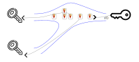

# Some Recipes for using DUECA Channels {#channelpatterns}

## Introduction

DUECA uses "channels" as a means to communicate between different parts of a simulation. Since a re-write (and the step in 2014 from the DUECA 0.x series to DUECA 2.x and above), these are implemented by the "UnifiedChannel" class. Its name suggests that these channels offer many possibilities, and that is true. While another [page](@ref dueca2) discusses the difference between the old DUECA channels and the new unified channel type, this page looks at the properties of the DUECA (unified) channels, and typical ways in which you may use these channels. 

## Events versus Stream

Channels are meant to transport simple C++ structs (the DCO objects, see the information on the [code generator](@ref codegenerator) ). A typical use of DCO objects in the context of flight simulation would be a DCO object (or multiple objects) transmitting the information from the pilot's input devices, such as sticks, throttle levers, etc. While the simulation is running, such devices always provide an input; there is position and force on the controls, etc. In DUECA, this is called the "time aspect", in this case the data is *Continuous*. When this data is written, the writing module provides a time span for the data; indicating from what time to what time this value is valid. Since having no value for a certain time can cause a problem elsewhere in the simulation, a stream channel needs to continuously be fed with data, and the validity intervals for that data need to match up while the simulation is running. 

For other parts of the simulation, it is not very convenient to transmit the data as continuous. For example when describing the key inputs to a flight management system, it is not necessary to continuously transmit "there was no key pressed" at times no key was pressed. And in some cases a pilot might hit two keys in the period for a single simulation model update. The time aspect for this data is defined as *Events* in DUECA. Event data is stamped with a single time point (not a time span!), and Event channel will happily accept multiple events for a single time, or none for that time. A channel with event data does not need to be filled continuously. 

## Endpoints and Entries, writing, reading

### Single writer, multiple readers, stream

In simple cases, a channel is written to by one module, there is only one DCO type written, and it can be read by multiple other modules. In that case the channel has one *entry*. 

This illustration shows a channel with only one writing token (right hand side), and therefore only one entry, entry #0. There are two (but there could equally be 0 or more) reading tokens. 

An entry has an entry number, optionally it has a label (string), describing the entry, and it only accommodates one type of data, i.e., one DCO type. A channel with a single entry only has entry number 0. In cases where you build a simulation for a single aircraft, or a controller or data recording application for a single device, such channels are exactly what you need. 

Given a write token `w_token`, of type ChannelWriteToken, as a member variable of your DUECA class, the writing end of this channel can be created as:

    w_token(getId(), NameSet("MyData://myentity"), 
        "MyData", "entry label"),

You must have created and listed (in your `comm-objects.lst` file), the `MyData` DCO class. The arguments to this call are explained as follows:

- GlobalId `owner`, the ID of the owner, normally the id of your module instance, which can be obtained with `getId()`. 
- NameSet `channelname`, the name of the channel. This is used for the publish-subscribe mechanism. In the above example, the channel's name is created from a single string, often the name is composed of the "entity", "dataclass" and "part" components, so the above nameset can als be created like: `NameSet("myentity", "MyData", "")`. 
-  std::string `entrylabel`, the entry label. Note that the entry label does not have to be unique.
-  Channel::EntryTimeAspect `time_aspect`. The time aspect determines the temporal nature of the data. In this case we have continuous values (stream data), which is the default for this parameter. The alternative here is `Channel::Events`, for event-like data.
-  Channel::EntryArity `arity`. In a writing token, the arity determines how many entries may be created. The default is `Channel::OnlyOneEntry`. This will prevent creation of multiple entries in this channel. In practice, this means that as soon as another write token is created on this channel, that that second write token will not become valid.
-  Channel::PackingMode `packmode`. The packing mode determines how the data is coded for transmission between DUECA nodes (computers). The default is `Channel::OnlyFullPacking`, thus each time data is written in the channel and when this data needs to be transported, the full data is coded and sent. The alternative is `Channel::MixedPacking`. In that case, whenever the first message is sent, the full data is packed, thereafter, only the differences between the latest data and new data are coded. If you have largely static information in the channel, with only minor updates when re-writing the data, mixed packing may be more efficient.
- Channel::TransportClass `tclass`. The transport class determines the priviledge of transmission. `Channel::Regular` will ensure packing as a regular message, the alternative is `Channel::Bulk`, which is appropriate for large objects. Bulk messages are packed after the regular data is packed, and bulk data may span several communication messages, so also large objects can be transmitted.
- UCallbackOrActivity `when_valid`. This is a callback function that can be used to detect when a token becomes valid. In most cases, it is sufficient to check the validity of your token in the `isPrepared` method of your class, with the `CHECK_TOKEN` macro:

    CHECK_TOKEN(w_token);

- unsigned `reservations`. This is needed only in special cases where no data from the channel may be lost in communication between two or more modules.

The read tokens for such a channel are created as follows:

    r_token(getId(), NameSet("MyData://myentity"), "MyData"),

These first three arguments are the same as for the write token. The further arguments for the first variation of the read token constructor (which in this case can all use the default value), are:;

- entryid_type `entryhandle`. This is the number of the accessed entry, in this case `0`.
- EntryTimeAspect `time_aspect`. The default is `Channel::AnyTimeAspect`, which means that the reading token will simply follow the writing token's suggestion on the temporal aspect of the data. In this example continuous data. 
- Channel::EntryArity `arity`. We have seen this before for the write token, but this has a slightly different meaning for the reading token. 
  - The default, `Channel::OnlyOneEntry`, will mean that the read token attaches itself to only one entry, in this case entry 0, and will become valid if that entry is compatible with the temporal aspect (which, with the given AnyTimeAspect, it will be), and the `data_class` is compatible, i.e., identical, or a parent class of the written dataclass.
  - `Channel::ZeroOrOneEntry` is similar, however the token will be marked as valid immediately.
  - `Channel::ZeroOrMoreEntries` should be combined with an `entry_any` value for the `entryhandle`. The token is immediately valid, and can be used to read any matching entry, where matching is determined by matching time aspect and data class.
  - `Channel::OneOrMoreEntries` is similar, but the token is valid only when there is an entry in the channel.

- Channel::ReadingMode `rmode` has a default of `Channel::AdaptEventStream`. The following reading modes are possible. 

  - `Channel::ReadAllData`. Data in the channel is returned sequentially, oldest data first. It is not possible to read the same data twice (by the same read token). If a time specification is supplied when reading, the data time is compared to that specification, and only "older" data `"<="` is returned. Note that you actually *must* read (or discard), the data, because the channel will try to reserve all that data for you. (Note that DUECA's channel viewer uses a Pacman-like symbol to show this).

  - `Channel::JumpToMatchTime`. This is the normal reading mode for stream data, the time specification supplied when reading is used to select the appropriate data. (DUECA's channel viewer uses a cherry symbol, indicating cherry picking).

  - `Channel::AdaptEventStream`, For channels with stream data, the reading will be done according to the `Channel::JumpToMatchTime` logic, and channels with event data will be read with `Channel::ReadAllData` logic. This option thus gives you the most common and sensible option to pair with stream respectively event data. 

  - `Channel::ReadReservation`. This is like `Channel::ReadAllData`, however it will use one of the reservations specified when the writing token was created. You can use this to make sure that no data is skipped or lost between the writing and reading end, as long as not all reservations have been used, all data written to the entry will be saved up. Note that just like reserving a table at a restaurant and not turning up, not using all reservations is impolite.

- `requested_span`. This is relevant for `Channel::JumpToMatchTime` reading. The channel end will keep the data for at least the requested time span. 

- `when_valid`. Specifies a callback function that is invoked when the reading token becomes valid. 

To write this channel, the writing token is used with a datawriter:

    DataWriter<MyData> d(w_token, ts);

    // use d.data() to access and write the MyData object
    d.data().<member> = <value>;

 
_TLDR;_ 

- Typically used to transmit regularly update data

- Creates a *stream* channel with a single entry

- Read tokens specify `Channel::JumpToMatchTime` reading of entry #0

- By default, the data will be kept valid for at least `0.2` seconds, meaning that only data that is 0.2s older than the latest data written will be cleaned from the channel memory.

- Typically, the read tokens are used as trigger, or combined in a trigger for the reading activity (usually with `and` logic), ensuring that the activity only runs when the data is valid. Reading may only fail when reading is really delayed, and data has in the meantime been cleaned out.

- If not specified as trigger, the reading may fail when data is not yet there. 

- Use a `DataReader` with the activity's time span to access the data of the required time.
  
- Add `MatchIntervalStartOrEarlier` to the `DataReader` when not triggering, and data for the current time may not be there.

### Single writer, multiple readers, event

If the writing token is created as 

    w_token(getId(), NameSet("MyData://myentity"), 
        "MyData", "entry label", Channel::Events),

And the reading token(s) similarly as above:

    r_token(getId(), NameSet("MyData://myentity"), "MyData"),

The single entry for this channel will contain events, so only for each (integer) time point there may be no data, a single data point or multiple data points, as illustrated in the figure below.

The reading will follow the `Channel::ReadAllData` logic, and events come in one by one, in the same order as written by the write token. If the time is omitted from the read action:

    DataReader<MyData> dr(r_token);

Any up to that point event data from the channel/entry will be returned. If the activity's current time is given:

    DataReader<MyData> dr(r_token, ts);

only data from before or at the time span start given in `ts` is returned. 

_TLDR;_ 

- For example used to transmit configuration events from an interface, or button presses, clicks, etc. from a device. 
- Creates an *event* channel with a single entry
- Read tokens typically use `Channel::ReadAllData` (automatic for the default of `Channel::AdaptEventStream`)
- Events are read one-by-one, use `haveVisibleSets(ts)` on the token to test for available events.
- Use a `DataReader` with time specification to get events from before or at the run time.
- Use a `DataReader` without time specification to simply get all available events.
- Only trigger on such a channel for an activity that only does event processing; if no events are writting, the activity will not be triggered.

### Multiple writers, multiple readers, stream

It is also possible to have multiple entries in a channel. Each entry is then associated with a channel write token, a module may declare multiple channel write tokens, or multiple modules may declare channel write tokens on the channel. 

If the writing tokens are created as 

    w_token1(getId(), NameSet("MyData://myentity"), 
        "MyData", "entry label", Channel::Continuous, Channel::OneOrMoreEntries),

    w_token2(getId(), NameSet("MyData://myentity"), 
        "MaybeOtherData", "another entry label", Channel::Continuous, Channel::OneOrMoreEntries),

    w_token3(getId(), NameSet("MyData://myentity"), 
        "MyData", "another entry label", Channel::Continuous, Channel::OneOrMoreEntries),

The writing tokens need to allow multiple entries (with `OneOrMoreEntries`), otherwise one or more of the tokens will not become valid. This type of channels is typically used in distributed simulation with multiple "entities". Each entity then represents an aircraft, other vehicle or the like. 

And a reading token can be created as:

    r_token(getId(), NameSet("MyData://myentity"), 
        "MyData", entry_any, Channel::Continuous, Channel::OneOrMoreEntries),

This reading token will become valid and can be used to read *all* entries that contain "MyData". The `entry_any` entry id indicates that multiple entries may be read with the same token. 

