# A simple simulation   {#example2}

## Introduction

DUECA/DUSIME has been running for over 20 years now, and previous
examples in the documentation have used older versions of the API. You
can still use this API, sometimes with warnings, but it would be nice
to have an extremely simple example with current "modern" DUECA, and
that is given in this page.

We keep things simple in this example. Only one new module and a
single new channel object is created, for the rest we use ready-made
modules. This simple simulation uses:

- A standard joystick (or a gui alternative), to get inputs to the
  simulation. For the joystick interaction, we will use the available
  FlexiStick module. In terms of DUECA programming, FlexiStick is a
  beast, and we will not discuss how it is made, just how we can use
  it.

- We create a new UFODynamics module, which will implement extremely
  simple motion, with a rigid-body "vehicle" that can rotate with the
  inputs of the joystick, and can move forward and back. It floats in
  the world, so there are no complex contact dynamics.

- To link the UFODynamics, we create a Dueca Channel Object, or DCO,
  which defines what kind of data we get from the stick and read in
  the UFODynamics module. Actually, to simplify the workflow, we will
  make this one first.

- To see what we are doing with the dynamics, we will use the
  WorldView module for a 3D view of the world. WorldView is another
  one of those all-out DUECA beasts, which means that it can in most
  cases be configured to do what we want without programming or
  modification.

To investigate the support DUECA/DUSIME can give, we will look into
some capabilities for enhancing a simulation. The FlexiStick can
record its output (the joystick or screen input) and play that back,
with DUSIME replay support. Now a good simulation should be
deterministic; given the same input and starting position, the same
output should result. The starting position is in this case determined
by the state of our UFODynamics, to record and control that, we add
initial condition facilities to the UFODynamics, at any moment its
state can be saved into a snapshot, and when the simulation is not
running, we can load from the snapshot.

After the simulation has been made, we look at a few more things:

- A mock set-up, in which we distribute the simulation over
  two DUECA nodes. This simulates running parts of your process on two
  computers.
- DUECA's timing overview, which shows the synchronization and timing
  of DUECA's nodes, and gives a summary of timing performance.
- DUECA's activity view, which enables us to take snapshots of DUECA
  timing, and inspect in depth what runs when.
- The channel overview, which enables inspection of channels (who
  writes what data, who reads it), and inspection of data in the
  channel.
- The DUSIME initial state control, for snapshot taking and re-loading.
- The DUSIME record and replay control, with which we can record a
  running simulation, and then later reload and replay that
  simulation.
- The net use overview, which shows the load on the network communication.
- DUECA's log files, startup blurp and error output.
- How to get script instructions on using module and other DUECA
  components.
- A simple program, dueca-channeldot, which can create a visual
  representation of your simulation from the logs.

If you want to explore a bit further, and look at how you could create
multiplayer simulations with DUECA, you can check out the sequel
[More Simple Simulation](#exampel2b).

## Setting up

I assume you have the dueca packages installed on a (real or virtual)
Linux computer, and can open a terminal window.

In this example we use dueca-gproject to set up the new project. We
first need a playground somewhere, on a local or remote git
repository. If you have access to a gitlab, github or similar site,
you can create a completely empty repository there. If you want to
play around locally, create an empty "upstream" repository by typing
in the terminal (I am using the prompt `[enter]$` here, your prompt
might look a little different:

~~~{.bash}
[enter]$ mkdir gitrepos
[enter]$ cd gitrepos
[enter]$ mkdir SimpleSimulation.git
[enter]$ cd SimpleSimulation.git
[enter]$ git init --bare
[enter]$ cd ${HOME}
~~~

If you created a repository like this locally, it will be at a
location on your computer, let's make a shell variable to have this
location:

~~~{.bash}
[enter]$ PROJECTURL=file://${HOME}/gitrepos/SimpleSimulation.git
~~~

If you created the repository somewhere else, use that URL. Let's also
indicate where we later can find the FlexiStick and WorldView projects
from which we want to borrow the stick and worldview code:

~~~{.bash}
[enter]$ export DAPPS_GITROOT_pub=git@github.com:dueca/
~~~

This code is available in the public `dueca` repository on github. If
you don't have an account there, you may access the code through https
instead:

~~~{.bash}
[enter]$ export DAPPS_GITROOT_pub=https://github.com/dueca/
~~~

## Creating the new project

Now we can create the initial project, we will collect our projects in
a folder dapps (DUECA Applications) in the home folder:

~~~{.bash}
[enter]$ cd
[enter]$ mdkir dapps
[enter]$ cd dapps
[enter]$
[enter]$ # the magic:
[enter]$ dueca-gproject new --name SimpleSimulation --remote $PROJECTURL
Created new DUECA project SimpleSimulation
~~~

Now enter the project folder. This is where your project-specific
code, the configuration for the project, and datafiles live.

~~~~{.bash}
[enter]$ cd SimpleSimulation/SimpleSimulation
[enter]$ ls
build  CMakeLists.txt  comm-objects  README.md  run
[enter]$ ls .config
class  machine  machinemapping.xml  policylist.xml
~~~~

We see here the following:

- A folder `build`, where later the built executable will appear
- A `CMakeLists.txt` file, to generate the main build configuration,
  which uses [cmake](https://cmake.org)
- A folder `comm-objects`, this will be the place for communication
  objects, also commonly called DCO objects, objects with data that
  can be sent around by DUECA.
- A file `README.md`, I trust you to modify this to your liking.
- A folder `run`, which is the place where run configurations are located.

There is one additional place with important stuff, and that is the
hidden folder `.config`. It contains the project configuration
information, we'll look there later.

## Version control with git

The creation of the empty project was performed on git's default
(master) branch. However, as we are now going to edit, modify and
possibly mess up a bit this project, it seems wise to work on a
dedicated git branch. Then after we are done we can maybe (if needed,
I let that up to you) clean up the history a bit, and merge the result
into master to get the final product.

~~~~{.bash}
[enter]$ git checkout -b initial-development
Switched to a new branch 'initial-development'
[enter]$ # make sure the branch is also on the 'remote`
[enter]$ git push --set-upstream origin initial-development
Total 0 (delta 0), reused 0 (delta 0), pack-reused 0
To file:///home/you/gitrepos/SimpleSimulation.git
 * [new branch]      initial-development -> initial-development
branch 'initial-development' set up to track 'origin/initial-development'.
~~~~

We will use that branch from here on.

## Borrowing modules

To get a good feeling and a head start, we can now borrow the
FlexiStick and WorldView modules. Still from the project folder, run
the following:

~~~~{.bash}
[enter]$ dueca-gproject borrow-module --name flexi-stick \
         --remote ${DAPPS_GITROOT_pub}FlexiStick.git
Borrowing DUECA module flexi-stick from project FlexiStick
~~~~

The script tells you what it does. Now what happened to your
project folder? Let's have a look:

~~~~{.bash}
[enter]$ cd ..
[enter]$ pwd
/home/you/dapps/SimpleSimulation
[enter]$ ls
FlexiStick  SimpleSimulation
~~~~

A folder with FlexiStick appeared one level up from the project
folder. This is where the FlexiStick code now lives:

~~~~{.bash}
[enter]$ ls FlexiStick
comm-objects  flexi-stick
[enter]$ ls FlexiStick/comm-objects
CMakeLists.txt    FlexiStickTest.dco  MediumJoystick.dco comm-objects.lst
[enter]$ ls FlexiStick/flexi-stick
ChannelAccess.cxx  flexi-stick-example.mod  HIDTouch.hxx        stickgui.glade2
ChannelAccess.hxx  FlexiStick.hxx           JoystickDevice.cxx  TouchDevice.cxx
CMakeLists.txt     GuiDevice.cxx            JoystickDevice.hxx  TouchDevice.hxx
comm-objects.lst   GuiDevice.hxx            mainpage.dox        WacomTouch.cxx
Counter.cxx        HIDBase.cxx              PolyConverter.cxx   WacomTouch.hxx
Counter.hxx        HIDBase.hxx              PolyConverter.hxx   WeightedSum.cxx
FlexiLink.cxx      HIDStick.cxx             StepsConverter.cxx  WeightedSum.hxx
FlexiLink.hxx      HIDStick.hxx             StepsConverter.hxx
FlexiStick.cxx     HIDTouch.cxx             stickgui.glade
~~~~

There is apparently a lot of stuff there. We don't need to inspect
that all now. Let's go back to the project folder, and inspect what
happened to the project configuration:

~~~~{.bash}
[enter]$ cd SimpleSimulation
[enter]$ ls .config/class/solo
config.cmake  modules.xml  modules.xml~
~~~~

I forgot to mention some things about machine classes. Let's keep it
simple for now, and say that we are developing code for machine class
`solo`. This is the initial machine class for DUECA, and it stands for
any development computer that you use to make your simulation. The
`config.cmake` file is obviously for your build configuration, and it
may adapt the build configuration for the machine class. For `solo` it
is practically empty, it only says we are using the `gtk3` toolkit for
windowing.

The two other files in that folder are `modules.xml` and
`modules.xml~`. This second one is a back-up with the previous
version, created when we borrowed the `FlexiStick` module. Let's take
a look:

~~~~{.bash}
[enter]$ cat .config/class/solo/modules.xml
<?xml version='1.0' encoding='UTF-8'?>
<!--
     this file contains a list of all modules needed for your application
     on a specific machine

     note that the comm-objects directories should *not* be listed here.
     The module name must be one of the folders in the given project.
     The project must contain the full path to a git repository

     If you encounter a message that a certain comm-objects folder cannot
     be found, use dueca-gproject borrow-project to add that project url

     If you need to check out from a specific branch, version or
     revision, add that in the optional version field.
-->
<machine xmlns="https://dueca.tudelft.nl"
  xmlns:xsi="http://www.w3.org/2001/XMLSchema-instance"
  xsi:schemaLocation="https://dueca.tudelft.nl https://dueca.tudelft.nl/schemas/modules.xsd">
  <project>
    <url>file:///home/you/gitrepos/SimpleSimulation.git</url>
  </project>
  <project>
    <url>dgrpub:///FlexiStick.git</url>
    <module>flexi-stick</module>
  </project>
</machine>
~~~~

As you can see, it is an XML file. It currently has only one module in
there, `flexi-stick`, from the project at the `FlexiStick.git`
URL. However, the `dueca-gitscript` project entered a URL alias here,
`dgrpub:///`. This is done on the basis of the environment variable
set earlier, which ended in `_pub`, in this way the `modules.xml` file
does not need to be modified if ever the access to the URL from which
you borrow FlexiStick changes, updating the environment variable will
fix that.

When we borrowed the module, the `dueca-gproject` script pulled
the code from the remote repository, and put it in an appropriate
place. If we later would want to clone our project somewhere else, the
`dueca-gproject` script will look at the appropriate `modules.xml`
file to see which code is needed and from where this code can be
obtained.

For the WorldView, we need several modules:

- The main `WorldView` module. This module will run all interaction
  with our simulation.
- A module `OSGViewer`, with an OpenSceneGraph backend. There are
  several back-ends in the `WorldView` project.
- A module `SpecificationBase`, which is needed by `OSGViewer`.
- Some 3D models to show something in our view. We borrow module
  `icy-world` from WorldView for that purpose.

Let's do this:

~~~~{.bash}
[enter]$ dueca-gproject borrow-module --name WorldView \
         --remote ${DAPPS_GITROOT_base}WorldView.git
Borrowing DUECA module WorldView from project WorldView
[enter]$ dueca-gproject borrow-module --name OSGViewer \
         --remote ${DAPPS_GITROOT_base}WorldView.git
Borrowing DUECA module OSGViewer from project WorldView
[enter]$ dueca-gproject borrow-module --name SpecificationBase \
         --remote ${DAPPS_GITROOT_base}WorldView.git
Borrowing DUECA module SpecificationBase from project WorldView
[enter]$ dueca-gproject borrow-module --name icy-world --pseudo \
         --remote ${DAPPS_GITROOT_base}WorldView.git
Borrowing DUECA module icy-world from project WorldView
~~~~

You can see for yourself in the `modules.xml` file what happened. We
borrowed icy-world as a `pseudo` module, with this we indicate that
this module has no (C++) code, and CMake will not try to use it in
building an executable.

## Intermezzo, what do we have now?

Let's check the current status of our project. We borrowed one module
from the FlexiStick project, and three modules from WorldView. Along
with the modules, the `dueca-gproject` script also pulled in the
`comm-objects` folders from these projects, since presumably the
modules in WorldView and FlexiStick rely on the communication objects
defined there. The `dueca-gproject` script analysed that dependency,
and pulled out the relevant folders.

Although, without a link between the joystick input and the 3D view on
the screen, the simulation now will not produce anything useful, we
can try compiling the project, to verify that we have all needed
software. Enter the build folder, configure the project, and then
build it:

~~~~{.bash}
[enter]$ # First enter the build folder
[enter]$ cd build
[enter]$ # Configure with cmake, specify debug options for later
[enter]$ cmake .. -DCMAKE_BUILD_TYPE=Debug
-- The C compiler identification is GNU 11.3.1
-- The CXX compiler identification is GNU 11.3.1
-- Detecting C compiler ABI info
-- Detecting C compiler ABI info - done
-- Check for working C compiler: /usr/bin/cc - skipped
-- Detecting C compile features
-- Detecting C compile features - done
-- Detecting CXX compiler ABI info
-- Detecting CXX compiler ABI info - done
-- Check for working CXX compiler: /usr/bin/c++ - skipped
-- Detecting CXX compile features
-- Detecting CXX compile features - done
-- Found Python: /usr/bin/python3.9 (found version "3.9.13") found components: Interpreter
-- Performing Test LD_WHOLEARCHIVE
-- Performing Test LD_WHOLEARCHIVE - Success
-- Performing Test LD_ALL_LOAD
-- Performing Test LD_ALL_LOAD - Failed
-- Project configuration for machine class solo
-- Included components python;extra;dusime;udp;hdf5;gtk3
-- Found PkgConfig: /usr/bin/pkg-config (found version "1.7.3")
-- Adding module FlexiStick_flexi-stick
-- Adding module WorldView_WorldView
-- Found osgDB: /usr/lib64/libosgDB.so
-- Found osgUtil: /usr/lib64/libosgUtil.so
-- Found osgViewer: /usr/lib64/libosgViewer.so
-- Found osg: /usr/lib64/libosg.so
-- Found OpenThreads: /usr/lib64/libOpenThreads.so
-- Found OpenSceneGraph: /usr/lib64/libosgDB.so;/usr/lib64/libosgUtil.so;/usr/lib64/libosgViewer.so;/usr/lib64/libosg.so;/usr/lib64/libOpenThreads.so (found version "3.4.1")
-- Adding module WorldView_OSGViewer
-- WorldView/OSGViewer depends on WorldView/WorldView
-- Adding module WorldView_SpecificationBase
-- Found DuecaCodegen: /usr/bin/dueca-codegen
-- DCO objects in folder FlexiStick/comm-objects
-- Adding object FlexiStickTest.dco
-- Adding object MediumJoystick.dco
-- Adding module FlexiStick_comm-objects
-- DCO objects in folder WorldView/comm-objects
-- Adding object ObjectMotion.dco
-- Adding object WorldViewerEvent.dco
-- Adding object WorldViewConfig.dco
-- Adding object ViewSpec.dco
-- Adding object WinSpec.dco
-- Adding object WorldDataSpec.dco
-- Adding object BaseObjectMotion.dco
-- Adding object BaseObjectPosition.dco
-- Adding module WorldView_comm-objects
-- Configuring done
-- Generating done
-- Build files have been written to: /home/you/gdapps/SimpleSimulation/SimpleSimulation/build
[enter]$
[enter]$ # Try to build the code
[ender]$ make
[  1%] Generating comm-objects.h, /home/you/dapps/SimpleSimulation/FlexiStick/comm-objects/comm-objects.h
[  3%] [DuecaCodegen][DCO] Code generation FlexiStickTest.dco
[  4%] [DuecaCodegen][DCO] Code generation MediumJoystick.dco
[  6%] Building CXX object FlexiStick/comm-objects/CMakeFiles/FlexiStick_comm-objects.dir/FlexiStickTest.cxx.o
# ... skipping a bit ...
[ 96%] Built target WorldView_OSGViewer
[ 98%] Building CXX object CMakeFiles/dueca_run.x.dir/empty.cxx.o
[100%] Linking CXX executable dueca_run.x
[100%] Built target dueca_run.x
~~~~

Your output may not look that perfect. The modules use a number of
libraries, and you might need to install these on your computer. The
`cmake` step will warn you when it is missing software, use your
package manager to install that software.

To simplify these steps a bit, you can also ask the `dueca-gproject` script
to configure and build your code for you. When using this, you do not need
to enter the `build` folder first, simply call this from any folder in your
project. To get, as in the above example, 
support for the debugger in your executable, just add a `--debug` flag:

    # alternative for cmake and make calls:
    dueca-gproject build --debug

As far as I can tell (things may change in the future), apart from the
DUECA packages and their dependencies, you will need the following
packages for a Debian-based Linux:

- `libsdl2-dev`
- `libopenscenegraph-dev`

So far so good. We created a new project, borrowed four modules,
configured the project, and compiled all the code so far. Now for the
difficult stuff.

## Creating the communication object

Our simulation will have simple UFO-like dynamics (if at least we can
decide on what that is like). Our UFO is like a ball that we can pitch
(forward/backward tilt) roll (tilting to left or right) and yaw
(rotating around to a new heading), all using a typical joystick with
a stick that can tilt forward and back, left and right, and has twist
axis for the yaw in the base. For moving around, we use the throttle
on the stick, giving us forward motion in the direction of the current
view point. Let's make a nice DCO (Dueca Communication Object) for
that. DCO objects use a Scheme or Lisp-like syntax, with parentheses
starting a command with zero or more arguments. A code generator will
use this description to create C++ code for objects that can be packed
and unpacked for transmission between DUECA nodes. Use the text editor
of your choice to create a file `ControlInput.dco` in the
`comm-objects` folder of your SimpleSimulation project, with the
following contents:

~~~~{.scheme}
;; -*-scheme-*-
(Header "
    from item       : ControlInput.dco
    date            : 220620
    category        : comm object specification
    description     : Simple joystick control input
    copyright       : (c) 2022 ...
    language        : C++")

;; Only type needed is float, define that
(Type float)

;; Communication of essential stick inputs to the SimpleSimulation UFO
(Object ControlInput
  ;; enable packing into messagepack format
  (Option msgpack)
  ;; Roll input
  (float roll (Default 0.0f))
  ;; Pitch input
  (float pitch (Default 0.0f))
  ;; Yawing
  (float yaw (Default 0.0f))
  ;; Commanded speed
  (float throttle (Default 0.0f))
)
~~~~

Alternatively, you can use the script `new-dco` to create that dco
file for you. As a minimum, `new-dco` requires the name of the DCO
file, and the corresponding object that you are trying to create, and
it produces a skeleton file to adapt to your liking:

~~~~{.bash}
[enter]$ new-dco object --name ControlInput
~~~~

You can also populate the object with more arguments:

~~~~{.bash}
[enter]$ new-dco object --name ControlInput \
                 --type float \
                 --option msgpack \
                 --member float roll "Roll input" \
                 --default 0.0f \
                 --member float pitch "Pitch input" \
                 --default 0.0f \
                 --member float yaw "Yawing" \
                 --default 0.0f \
                 --member float throttle "Commanded Speed" \
                 --default 0.0f
~~~~

Note the following:

- Comments are started with a semicolon (;)
- The `Header` command gives some text to include in the generated
  code, with the given format, these comments are nicely merged in the
  C++ header. The generated code for this DCO object will end up in
  build/SimpleSimulation/ufo-dynamics/ControlInput.[ch]xx. Take a peek
  there for how the C++ code looks.
- Comments before the defined object ("Communication .."), and before
  member definitions in the object are carried over into the generated
  C++ code, and they use the Doxygen format, so automatic document
  generation works.
- Each type that you use in a DCO object needs to be declared as such
  first, that is the reason for the `(Type float)` line.

Before we continue, add the communication object to the repository, and
commit your work.

~~~~{.bash}
[enter]$ git add comm-objects/ControlInput.dco
git commit -m "add DCO file for stick control input"
~~~~

Look at the explanation of the [code generator](#codegenerator) for
more options.

## Creating the new module

Next, we create the new module. This is a two-step process, first
configure, with `dueca-gproject`, a folder for the module, and then
create and adapt the code. We'll call the new module `ufo-dynamics`,
make sure you start from the main project folder
(`SimpleSimulation/SimpleSimulation`):

~~~~{.bash}
[enter]$ dueca-gproject new-module --name ufo-dynamics
Created new DUECA module ufo-dynamics in project SimpleSimulation
[enter]$ # and let's see what is there
[enter]$ ls ufo-dynamics
CMakeLists.txt  comm-objects.lst
~~~~

The `CMakeLists.txt` has information on how to build any code in
`ufo-dynamics`, the `comm-objects.lst` file contains a list of
communication objects that are needed by our new module. Let's add the
`ControlInput.dco` file to that. Use your favourite text editor, and
modify `comm-objects.lst`, until it looks like the following:

~~~~{.bash}
[enter]$ cat ufo-dynamics/comm-objects.lst
# this file contains a list of all communicated objects needed by this
# specific module
# specify these with the .dco extension, examples:
# SimpleSimulation/comm-objects/MyDataObject.dco
# Generic/comm-objects/PrimaryControls.dco
SimpleSimulation/comm-objects/ControlInput.dco
~~~~

Now make the code for the new module. We are going to use a DUSIME
module, since we will implement a simulation, and want to use typical
simulation modes.

~~~~{.bash}
[enter]$ cd ufo-dynamics
[enter]$ new-module dusime UFODynamics
The size of the state, in bytes : 1
A description for the activity:  : update UFO dynamics
~~~~

We had to enter the size of the state, and a description for the
activity. In the past, it used to be important to indicate a correct
size for the state, but that is no longer relevant, only the
difference between 0 (no state, no snapshots) and non-zero
matters. The non-zero answer given here will make sure that we will be
able to capture and restore the Module's state, which we will use later.

This command added a header file and a body file, tell git to remember
these:

~~~~{.bash}
[enter]$ ls
CMakeLists.txt  comm-objects.lst  UFODynamics.cxx  UFODynamics.hxx
[enter]$ git add UFODynamics.?xx
~~~~

### Adding the communication to the new module

We want the new module to read the signals from the joystick and then
tell the WorldView what the position is of the controlled UFO, so that
the outside world can be correctly drawn. To make the communicated
classes available, edit the `comm-objects.lst` file in `ufo-dynamics`,
until it looks as follows:

~~~~{.bash}
[enter]$ cat ufo-dynamics/comm-objects.lst
# this file contains a list of all communicated objects needed by this
# specific module
# specify these with the .dco extension, examples:
# SimpleSimulation/comm-objects/MyDataObject.dco
# Generic/comm-objects/PrimaryControls.dco
SimpleSimulation/comm-objects/ControlInput.dco
WorldView/comm-objects/BaseObjectMotion.dco
~~~~

Now, let's first set up the communication in the UFODynamics code. Use
an editor on the UFODynamics header file, and add a read and a write token
(uncomment the example, and change the names):

~~~~~~~~~~{.cxx}
private: // channel access
  // declare access tokens for all the channels you read and write
  // examples:
  /** Control input from the joystick */
  ChannelReadToken    r_controls;

  /** Our viewpoint to send to the world view */
  ChannelWriteToken   w_egomotion;
~~~~~~~~~~

In DUECA, channels transport data between modules. A module can not
directly access a channel, only through an access token. If you create
a token, it will ensure that a channel end will be created locally, or
it will create a connection to an already existing channel end.

Then make the matching changes in the `UFODynamics.cxx` file, to
correct the constructor code. We know that (for our simulation), there
is only one entry in the controls channel, with a datatype
`ControlInput`, and we will configure it to be written as stream data;
for each simulation time step, there will be current data available
for that time step's time span.

The egomotion channel also has one entry, it gets written by our
`UFODynamics` module, also as stream data. This channel will be used
by the WorldView module to determine what should be the viewpoint on
the world. The following code lists the creation of the two tokens:

~~~~~~~~~~{.cxx}
  // initialize the channel access tokens
  r_controls(getId(), NameSet(getEntity(), "ControlInput", part),
             "ControlInput", 0, Channel::Continuous, Channel::OnlyOneEntry),
  w_egomotion(getId(), NameSet(getEntity(), "ObjectMotion", part),
              "BaseObjectMotion", "ufo movement", Channel::Continuous,
              Channel::OnlyOneEntry),

  // activity initialization
  // myclock(),
  cb1(this, &_ThisModule_::doCalculation),
  do_calc(getId(), "update UFO dynamics", &cb1, ps)
{
  // do the actions you need for the simulation

  // connect the triggers for simulation
  do_calc.setTrigger(r_controls);
}
~~~~~~~~~~

Obviously, for our simulation, we would first have to read the
joystick input, then calculate the dynamics for our model in
ufo-dynamics, and with that outcome draw the view on the world with
WorldView. In DUECA, that schedule is not explicitly specified,
instead we specify "triggers". By triggering the activity for the
dynamics (the `do_calc` object), on the data written by the joystick,
it is ensured that the function `UFODynamics::doCalculation` is
triggered whenever new data has been written. Here we do that with the
`setTrigger` call:

~~~~~~~~~~{.cxx}
  do_calc.setTrigger(r_controls);
~~~~~~~~~~

In this case, this triggering waits only on the activities in one
channel. If you would have wanted to wait for data in two channels,
combined trigger conditions can be created, simply like:

~~~~~~~~~~{.cxx}
  do_calc.setTrigger(r_controls && r_token_for_some_other_channel);
~~~~~~~~~~

The triggering actually looks at the times for which data is written,
and logically combines these to trigger the activity. DUECA's
scheduling facilities then actually run the associated function, with
the priority determined by the `PrioritySpec` object passed to the
`UFODynamics` constructor call.

The channel names are specified here with `NameSet` objects, in the
form (entity, class, part). The 'entity' is the object to which the
channel will belong, its name will be supplied later in the creation
script. In many cases, the part is an empty string, but part can also
be used to differentiate multiple similarly-named channels belonging
to the same entity. 'class' is the type of data, note that this may be
freely chosen, but for simple channels (one entry, with one specific
type of communication object), it is customary to list the
communication object type here. So the "class" of the `r_controls`
token/channel is `ControlInput`, while the class of the datatype sent
over that channel is also `ControlInput`. NameSets can also be written
in a URL type fashion, for a contrived example see the following:

~~~~~~~~~~{.cxx}
 NameSet("ControlInput://myentity/somepart/or/other")
~~~~~~~~~~

Channels can have multiple "entries", each entry represents a sort of
slot in which a specific type of data can be written, and all data is
time-tagged, so that the history (or part of the history) can be seen.

Multiple entries in a channel are sometimes used to for example
represent all "other" vehicles in a simulation, but most channels have
just one entry. In this channel, we expect only one entry (entry 0),
so in the token construction call we specify that entry number and the
parameter `Channel::OnlyOneEntry`. The data should be a continous
stream (`Channel::Continuous`), which means that the data written
there represents some continuous variable, rather than events or
things that may happen or not happen at a specific time;
`Channel::Events` is the main other option for channels. If the
conditions set for the read token are not met (we specified continous
data, and exactly one entry in the channel), the token will not become
valid, and at least we will know our simulation is not correct yet.

The channel that we write to the WorldView likewise has only one
entry, we again specify that with the `Channel::OnlyOneEntry`
parameter. In this case, the class for the channel ("ObjectMotion"),
is different from the (c++) class of objects we send over the channel
("BaseObjectMotion"). Here we can also give a label for the entry
("ufo movement").

### Checking and running

Before DUECA will run a module's activities, it will try to check the
status of the module, in this case with the `UFODynamics::isPrepared`
call. Here you should verify that all conditions for continuing are
met, in this case, checking that the tokens are valid; there is a
handy macro for that:

~~~~~~~~~~{.cxx}
// tell DUECA you are prepared
bool UFODynamics::isPrepared()
{
  bool res = true;

  CHECK_TOKEN(r_control);
  CHECK_TOKEN(w_egomotion);

  // return result of checks
  return res;
}
~~~~~~~~~~

For running our update loop, so once per time step, we use the
`doCalculation` method. Something you need to be aware of is that
DUECA is data-driven, and so if there is no data, there is normally no
simulation. Whether you read the data or not is not critical, but our
module must always *produce* data when it runs. For our initial
set-up, we will add the reading of the control input, but not do
anything with that data, and add writing of a fixed viewpoint to the
WorldView. Here is how `doCalculation` should be modified:

~~~~~~~~~~{.cxx}
void UFODynamics::doCalculation(const TimeSpec& ts)
{
  // check the state we are supposed to be in
  switch (getAndCheckState(ts)) {
  case SimulationState::HoldCurrent: {
    // only repeat the output, do not change the model state

    break;
    }

  case SimulationState::Replay:
  case SimulationState::Advance: {
    // access the input
    try {
      DataReader<ControlInput> u(r_controls, ts);

      // printing, for now
      std::cout << u.data() << std::endl;
    }
    catch(std::exception& e) {
      W_MOD("Could not read control input at " << ts);
    }
    // do the simulation calculations, one step

    break;
    }
  default:
    // other states should never be entered for a SimulationModule,
    // HardwareModules on the other hand have more states. Throw an
    // exception if we get here,
    throw CannotHandleState(getId(),GlobalId(), "state unhandled");
  }

  DataWriter<BaseObjectMotion> y(w_egomotion, ts);

  // set our viewpoint high enough to see something
  y.data().xyz[2] = -3.0;

  if (snapshotNow()) {
    // keep a copy of the model state. Snapshot sending is done in the
    // sendSnapshot routine, later, and possibly at lower priority
    // e.g.
    // snapshot_state_variable1 = state_variable1; ...
    // (or maybe if your state is very large, there is a cleverer way ...)
  }
}
~~~~~~~~~~

Note that `doCalculation` is called with a `TimeSpec` object. This
defines the time span for which this calculation is now running, which
will be the same time span as for the data written in the channel from
the joystick (which triggered this activity). When accessing the
joystick with the `r_controls` token, that `TimeSpec` is again
used. This ensured that we access the data with a consistent time.

~~~~{.cxx}
      DataReader<ControlInput> u(r_controls, ts);
~~~~

The `DataReader` object `u` gives access to the data in the channel,
through its `data()` function. At the end of the enclosing curly
braces, the object `u` is destroyed, and the destructor call releases
the access to the channel data.

The `DataWriter` is simular, this one uses the `TimeSpec` to determin
for which time the data must be written.

We set the height to -3.0 m (WorldView uses aerospace conventions for
axes, and the z-axis points down into the ground).

The `doCalculation` routine is called with a time specification
`ts`. This specifies the time span for which the calculation should be
carried out. Time in DUECA is divided into integer steps, one step, or
a granule, has a user-definable duration. The activity `do_calc` is
linked to the `doCalculation` routine. By specifying that this
activity is triggered on the control channel, each data span written
in the controls channel leads to a call of the `doCalculation`
routine, with the span specified in `ts`.

Within the routine, that time span is used to retrieve the data from
the controls channel, and to write the new data in the egomotion
channel.

## Trial run 1

### Compilation

At this point, our code should be good enough to give it a trial
run. The simulation is not yet in there, but there is input,
triggering, and output. Let's try a compilation:

~~~~{.bash}
dueca-gproject build --debug
~~~~

You will see that the build now automatically includes the
`ControlInput.dco` file, and the new module we added. In most cases,
c++ header and body files in a module are automatically included for
compilation, if you don't want that, adapt the `CMakeLists.txt` files.

This creates an executable called `dueca_run.x`. It contains the
module we developed, and the borrowed modules and code from FlexiStick
and WorldView. To start a simulation with these, we need two (python)
scripts, one that starts the DUECA code, and one that configures the
simulation. A DUECA executable may be stuffed with modules and other
code, but as long as you don't start up that code in a start script,
it will do nothing. The contents of a DUECA executable can be
inspected with:

~~~~{.bash}
[enter]$ ./dueca_run.x --version
Adding module (ufo-dynamics)
Adding module (flexi-stick)
Adding module (world-view)
Adding object (OSGViewer)
Init from     [dueca-dusime]
Adding object (ReplayFiler)
Adding module (inco-calculator)
Adding module (dusime-bare)
Init from     [dueca-udp]
Adding virt   (Accessor)
Adding virt   (GenericPacker)
Adding object (Unpacker)
Adding object (Packer)
Adding object (FillUnpacker)
Adding object (FillPacker)
Adding object (NetMaster)
Adding object (NetPeer)
Adding module (net-use-overview)
Init from     [dueca-hdf5]
Adding module (hdf5-logger)
Adding module (hdf5-replayer)
Init from     [dueca-gtk3]
Adding module (timing-view)
Adding module (activity-view)
Adding module (dueca-view)
Adding module (log-view)
Adding module (channel-view)
Adding GUI    "gtk3"
Init from     [dueca-dusime-gtk3]
Adding module (dusime)
Adding module (replay-master)
Adding module (initials-inventory)
Init from     [dueca-udp-gtk3]
Adding module (net-view)
Init from     [dueca-extra]
Adding module (gl-sweeper)
Dueca version 3.2.0
Copyright (c) 1998 - 2022 Delft University of Technology - AE - C&S
~~~~

You see a report on the various modules and objects built into this
executable. Most of these come from DUECA libraries, but the first
four are found in our new project.

Specific script instructions for a module can be obtained with:
~~~~{.bash}
[enter]$ DUECA_SCRIPTINSTRUCTIONS=ufo-dynamics ./dueca_run.x
dueca.Module('ufo-dynamics', <part name; string>, <PrioritySpec>).param(
    set_timing = <TimeSpec>,
    # Supply a time specification to define the update rate of the main activity
    check_timing = <array of integers>,
    # Supply three integer parameters to specify a check on the timing of
    # the main activity: warning limit (in us), critical limit (in us), and
    # the number of loops to test before sending a report (optional, dflt=2000)
    )
'''Description:
please give a description of this module'''
~~~~

This indicates that with the command `dueca.Module` with the given
parameters, will create a `ufo-dynamics` module. There can be two
parameters in this call, to set the timing (update rate) of the
module, and one to add checks on the timing. You can try the other to
modules (`flexi-stick` and `world-view`, and the object `OSGViewer`
yourself. If you want, you can edit the last string in the
`UFODynamics::getParameterTable` function to get a better description
for the module.

Any parameters defined in the `UFODynamics::getParameterTable`
function give the script language (Python or Scheme), access to
variables or functions from the newly created class. This happens
right after the constructor call. When all parameters are set, the
`UFODynamics::complete()` call is called. For UFODynamics, that call
is empty, but in many modules this is used for various purposes.

With that knowledge we can now move to the run folder for our platform,
and start to adapt the start scripts for the simulation:

~~~~{.bash}
[enter]$ cd ..
[enter]$ cd run/solo/solo
[enter]$ ls
clean.script  dueca_cnf.py  dueca_mod.py  links.script
~~~~

In a fresh run folder, you should see four files. The `links.script`
should populate your run folder with files (usually symbolic links)
that you need for running the simulation.

The `clean.script` reverses that action, and it should clean out your
run folder from any generated or linked configuration files.

The file `dueca_cnf.py` contains the commands for starting DUECA
itself. If you run a distributed DUECA over multiple computers, this
fill will tell each DUECA "node" how to connect to the others and how
to configure itself.

There is also a file `dueca_mod.py`. On a project with multiple
computers running a distributed DUECA, only one `dueca_mod.py` is
needed. It is only needed in DUECA node 0, the "master" node, and it
configures the simulation or application you want to run with DUECA.

### Datafiles configuration

Before we can see anything on our screen, we need to have access to
the 3D graphics models for the OpenSceneGraph viewer. We can add some
instructions to the `links.script` file to make symbolic links to
these files. Modify your links.script file to:

~~~~{.bash}
[enter]$ cat links.script
# -*-sh-*-
# this file creates all links to files in the data directory needed for
# running the application on a specific machine.

# standard folder with project-wide data
DATADIR=../../run-data

# example for project-wide configuration (.cnf) files
# ln -sf $DATADIR/*.cnf .

# create a folder for run log history
if [ ! -d runlogs ]; then
   mkdir runlogs
fi

# convenience link to executable (cmake or legacy)
if [ -d ../../../build ]; then
   ln -sf ../../../build/dueca_run.x .
else
   ln -sf ../../../dueca_run.x .
fi

# Added for SimpleSimulation, link .obj and .mtl files for the visual
ln -sf ../../../../WorldView/icy-world/*.obj .
ln -sf ../../../../WorldView/icy-world/*.mtl .
~~~~

Now execute the `links.script` file with:

~~~~{.bash}
[enter]$ . links.script
[enter]$ # verify that the files are here
[enter]$ ls
clean.script  dueca_mod.py  links.script  skydome.mtl  terrain.mtl
dueca_cnf.py  dueca_run.x   runlogs       skydome.obj  terrain.obj
~~~~

### Run configuration

Usually the `dueca_cnf.py` file needs no adaptation for the `solo`
platform, the platform we are currently developing on. We will look at
that file later, when we try to run two DUECA processes on one
computer, to simulate a distributed DUECA. The `dueca_mod.py` file
contains Python instructions to create the simulation. The C++ modules
and code we added to the `dueca_mod.x` executable are available as
classes and functions in a `dueca` module to Python.

A `dueca_mod.py` file typically starts with setting up some variables
for your simulation. In a DUECA simulation with multiple nodes (dueca
processes usually running on multiple computers), each node has a
number, and the node set-up is listed in the start of the file.

DUECA runs multi-threaded, each thread is used for DUECA activities
with a specific priority. The next section sets up the different
priorities used in this process, by creating the appropriate
`PrioritySpec` objects. The first argument in a PrioritySpec is the
priority or thread in which the activity should be run, the second is
the order; when multiple activities could be run at the same time, the
ones with the highest order runs first. Note that with properly set-up
triggering, adapting the order is seldom needed, it is usually left at
0. Here we are using:

~~~~{.py}
# administration priority. Run the interface and logging here
admin_priority = dueca.PrioritySpec(0, 0)

# logging prio. Keep this free from time-critical other processes
log_priority = dueca.PrioritySpec(1, 0)

# priority of simulation, just above log
sim_priority = dueca.PrioritySpec(2, 0)
~~~~

In addition, the update rate for different activities can be
specified, and the timings are defined with DUECA `TimeSpec`
objects. Time in DUECA runs in integer increments, the `dueca_cnf.py`
script defines how many increments correspond to a second. A section
from that file lists:

~~~~{.py}
### parameters defining "size" of the time. Note that all nodes should have
### the same compatible_increment, and for all nodes
### tick_time_step/tick_base_increment should be the same
tick_base_increment = 100              # logical increment of time, each tick
tick_compatible_increment = 100        # same, but used at start_up
tick_time_step = 0.01                  # time step for each tick
communication_interval = 100           # interval for initiating comm
~~~~

The `tick_time_step` is the update rate for this DUECA node. In each
update tick, the integer time used to keep track of time in DUECA is
incremented with the `tick_base_increment` value. When we divide the
time step given here by the base increment, we get a value of 0.0001
s, or 100 microseconds. In our set-up, this 0.0001s is the "time
granule", the smallest time duration that can be expressed in the
counter. Specifying timing uses these granules, here is the default
set-up in the `dueca_mod.py` script:

~~~~{.py}
# this is normally 100, giving 100 Hz timing
sim_timing = dueca.TimeSpec(0, 100)

## for now, display on 50 Hz
display_timing = dueca.TimeSpec(0, 200)

## log a bit more economical, 25 Hz
log_timing = dueca.TimeSpec(0, 400)
~~~~

The first parameter in a `TimeSpec` is normally the start time (as we
saw above), however here it is used as a type of offset, it is
normally kept at 0. The second parameter is the validity end, in this
case, with start at 0, it doubles to define the time span. By
multiplying this with the time granule value of 0.0001s, we get the
duration of a time step for the activity.

The next section in the file creates modules for use by DUECA itself,
we skip that for now, and thereafter begins a section for your
project. Here we need to create and configure the borrowed modules and
the new module. Let's start with the FlexiStick module:

~~~~{.py}
if this_node_id == ecs_node:
    mymods.append(
        dueca.Module(
            "flexi-stick", "", sim_priority).param(
            set_timing = sim_timing,
            enable_record_replay = True,
            check_timing = (1000, 2000)).param(
            # logitech stick, first SDL device
            ('add_device', "logi:0"),

            # by default, axes go from -1 to 1, convert throttle to
            # run from -1 to 5 (slow back-up to forward 5m/s), with
            # a polynomial. The throttle is on axis 2 of the stick
            ('create_poly', ('throttle', 'logi.a[2]')),
            ('poly_params', (2, -3)),
            ('create_poly', ('roll', 'logi.a[0]')),
            ('poly_params', (0, -1)),
            ('create_poly', ('pitch', 'logi.a[1]')),
            ('poly_params', (0, -1)),
            ('create_poly', ('yaw', 'logi.a[2]')),
            ('poly_params', (0, -1)),

            # define that we write a channel
            ('add_channel',
             ('controls',              # variable
              'ControlInput://SIMPLE', # channel name
              'ControlInput',          # data type
              'control input')),       # label

            # link axis 0 to control roll, etc, etc
            ("add_link", ("controls.roll", "roll")),
            ("add_link", ("controls.pitch", "pitch")),
            ("add_link", ("controls.yaw", "yaw")),
            ("add_link", ("controls.throttle", "throttle"))
            )
    )
~~~~

You can see that this creation is guarded in an `if` statement. For
our single node run this will not be necessary, but with this
structure we can also use a single `dueca_mod.py` file for a complete
simulation, only creating modules in the nodes where they are needed.

FlexiStick is pretty flexible, and can be configured extensively
through the script. The `dueca.Module` call creates a new module
linked to the FlexiStick code in C++, with a certain "part" name, in
this case an empty string, and a priority. The object can then be
further defined by setting parameters, with the `.param` calls. The
first one of these sets the module timing, and adds a check on the
timing, with warning levels at 1000 and 2000 microseconds.

You can se we used python keyword arguments `set_timing` and
`check_timing`. Most modules will offer these two parameters, these
are defined in the `ParameterTable` for the module. The rest of the
configuration will be specific to the FlexiStick module, if you want
to know more, look into the documentation of FlexiStick.

For the further configuration we will want to repeat some parameters,
and Python will not allow us to do that with keyword arguments. We
therefore use a second form of supplying parameters to modules, with
argument name and value tuples. The `.param` call is "chained", and we
specify the joystick we want to read:

~~~~{.py}
            # logitech stick, first SDL device
            ('add_device', "logi:0"),
~~~~

This means that SDL joystick 0 will be used, and in the following it
will be available under the name `logi`. `logi.a[0]` will be the first
axis, `logi.b[0]` wil be the first button, etc. Now I want to reverse
most of the axes, since in aviation I learned that forward/down and
left control inputs are labeled positive, and the stick has all that
reversed. Also, I want a "moderate" reverse speed, and more forward
speed with the throttle. The axis values are scaled -1 to 1, and with
polynomials we can re-scale that. The polynomials add new "variables"
to the FlexiStick module, here is a fraction of that:

~~~~{.py}
            ('create_poly', ('throttle', 'logi.a[3]')),
            ('poly_params', (2, -3)),
            ('create_poly', ('roll', 'logi.a[0]')),
            ('poly_params', (0, -1)),
~~~~

FlexiStick can write any DCO type to a channel, we configured:

~~~~{.py}
            ('add_channel',
             ('controls',              # variable
              'ControlInput://SIMPLE', # channel name
              'ControlInput',          # data type
              'control input')),       # label
~~~~

Note that this uses the `ControlInput` DCO type that we defined
earlier. What is left is defining how the axes, buttons and variables
we now have in the FlexiStick module are linked to the objects written
in the channel:

~~~~{.py}
            ("add_link", ("controls.roll", "roll")),
            ("add_link", ("controls.pitch", "pitch")),
            ("add_link", ("controls.yaw", "yaw")),
            ("add_link", ("controls.throttle", "throttle"))
~~~~

This uses introspection built into the DCO types to get the data to
the right place.

OK, one module down, two to go. Our new dynamics module for now has no
specific parameters, we make it with:

~~~~{.py}
    # our new dynamics module
    mymods.append(dueca.Module(
        "ufo-dynamics", "", sim_priority).param(
            set_timing = sim_timing,
            check_timing = (1000, 2000)))
~~~~

Note that it is conditional on the same `if` statement we had for the
FlexiStick. The WorldView module is again more complex. It can have
several different back-ends for showing the graphics, and in this case
we use an OpenSceneGraph backend.

~~~~{.py}
    # the visual output
    mymods.append(
        dueca.Module(
            "world-view", "", admin_priority).param(
            set_timing = display_timing,
            check_timing = (8000, 9000),
            set_viewer =
            dueca.OSGViewer().param(
                # set up window
                ('add_window', 'front'),
                ('window_size+pos', (800, 600, 10, 10)),
                ('add_viewport', 'front'),
                ('viewport_window', 'front'),
                ('viewport_pos+size', (0, 0, 800, 600)),

                # add visual objects (classes, then instantiation)
                ('add-object-class-data',
                 ("static:sunlight", "sunlight", "static-light")),
                ('add-object-class-coordinates',
                 (0.48, 0.48, 0.48, 1,   # ambient
                  0.48, 0.48, 0.48, 1,   # diffuse
                  0.0, 0.0, 0.0, 1,      # specular
                  0.4, 0.0, 1.0, 0,      # south??
                  0, 0, 0,               # direction not used
                  0.2, 0, 0)),           # no attenuation for sun
                # create an object class for the terrain, to be represented
                # as a static (not position controlled) object, with
                # terrain.obj as the file defining it
                ('add-object-class-data',
                 ("static:terrain", "terrain", "static", "terrain.obj")),
                # same for skydome
                ('add-object-class-data',
                 ("centered:skydome", "skydome", "centered", "skydome.obj")),
                # move the skydome default position a bit down
                ('add-object-class-coordinates',
                 (0.0, 0.0, 50.0)),

                # make static objects through the configuration.
                # These match the creation keys (static:sunlight etc), to
                # find the right object class.
                ('static-object', ('static:sunlight', 'sunlight')),
                ('static-object', ('static:terrain', 'terrain')),
                ('static-object', ('centered:skydome', 'skydome'))
            )
            )
    )
~~~~

This configuration starts with setting up a window, and a viewport
within that window. It is also possible to set a specific projection
matrix, e.g., to match the configuration of a specific simulator, but
we will skip that for now.

We then define some classes of visual objects, a light, skydome and
terrain, and create/instantiate these objects.

### Running

Now let's try to run this:

~~~~{.bash}
[enter] $ ./dueca_run.x
Adding module (ufo-dynamics)
Adding module (flexi-stick)
Adding module (world-view)
Adding object (OSGViewer)
Init from     [dueca-dusime]
... snipped a bit ...
Adding object (ChannelManager)
Adding GUI    "none"

This application uses DUECA/DUSIME, version 3.2.0 (12 Jun 2022)
Copyright for DUECA libraries, headers & tools:
Copyright (c) 1998 - 2022 Delft University of Technology - AE - C&S
Copyright (c) 2022 - 2022 DUECA authors

Licensed under the EUPL-1.2 license

Starting interpretation of the dueca config script
program name /home/you/gdapps/SimpleSimulation/SimpleSimulation/run/solo/solo/dueca_run.x
11:06:08.702768 wCNF Set ticker priority to 4
11:06:08.702891 iSYS Popped up from script, stage=1
11:06:08.702905 iSYS Creating the node manager
11:06:08.703012 iSYS Completing dueca objects
11:06:08.703388 iSYS slow ticking
11:06:09.905685 iSYS Node 0 changed to state NodeJoining
11:06:10.005993 iSYS Node 0 changed to state NodeJoined
11:06:10.006081 iSYS slowing down node query at time TimeSpec(1300, 1300)
11:06:10.106236 iSYS Dueca nodes now complete
11:06:10.107766 iSYS Node 0 changed to state NodeSynced
11:06:11.209231 iSYS Real-time running, two seconds from now ....
11:06:11.209297 iSYS id(0,2)Returning to script
11:06:11.213068 iSYS Popped up from script, stage=2
11:06:11.213118 wSYS Su: no root/super user capabilities
11:06:11.213144 iSYS id(0,2) trying memlock without root capability
11:06:11.213176 wSYS Cannot memlock the DUECA executable: Cannot allocate memory
11:06:11.213202 iSYS id(0,2) creating graphics thread with (e)uids: 1000, 1000
11:06:11.213300 iSYS Halting script thread
11:06:11.213525 iSYS Initializing gtk3 graphics
11:06:11.474354 iMOD Opened joystick logi type Logitech Force 3D Pro
11:06:11.477636 iSYS id(0,2) passing control to graphics lib
11:06:11.477664 iSYS Passing control to gtk 3.x
11:06:13.209236 iSYS Time to start real-time running
11:06:13.209782 iSYS id(0,2) starting activity managers
11:06:13.209939 wSYS Failure trying to adjust scheduling priority: Operation not permitted
11:06:13.209991 wACT ActivityManager 1 mode requested FIFO actual OTHER
11:06:13.309979 wSYS Failure trying to adjust scheduling priority: Operation not permitted
11:06:13.310030 wACT ActivityManager 2 mode requested FIFO actual OTHER
11:06:13.410066 wSYS Failure trying to adjust scheduling priority: Operation not permitted
11:06:13.410119 wACT ActivityManager 3 mode requested FIFO actual OTHER
11:06:13.510148 wSYS Failure trying to adjust scheduling priority: Operation not permitted
11:06:13.510201 wACT ActivityManager 4 mode requested FIFO actual OTHER
11:06:13.610182 iSYS id(0,2) setting ticker to autonomous
11:06:13.610243 iTIM First schedule for tick PeriodicTimeSpec(4700, 4800 p:100) with ActivityManager 4
~~~~

Don't worry too much about the scheduling priority messages. These
indicate that it is not possible now to run with real-time
priority. During development, real-time running is seldom needed, in
most cases the simulations run fine, and DUECA is robust enough to not
mess up when the timing is a bit off. When running with actual
simulation hardware the real-time capability is important, see the
page on [Tuning Linux Workstations](#tunelinux) for how to do that.

You will see that there is also a new window:

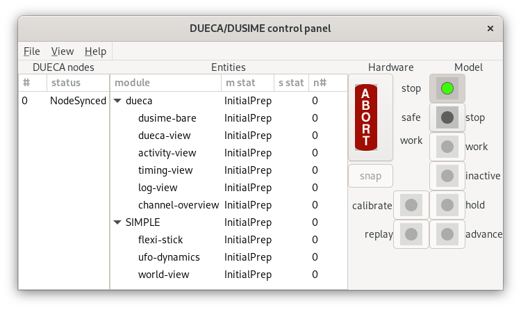

I opened the view of the `dueca` and `SIMPLE` entities, and slightly
stretched the window so that this fits. The single node in this
simulation is apparently now synchronized with itself. Now run the
simulation by pressing on the "safe/stop" button, and when that is
green press on the "work" button. If that does not work, check the
terminal output, maybe you have a problem validating a channel token
due to some typing error.

When the "work" button is green, you have completed the DUECA state
machine; as far as DUECA is concerned, things are running. The buttons
below (inactive, hold, calibrate, replay, advance), are all part of
the DUSIME state machine, which implements typical simulations.

You will also see that the window for the WorldView came up:

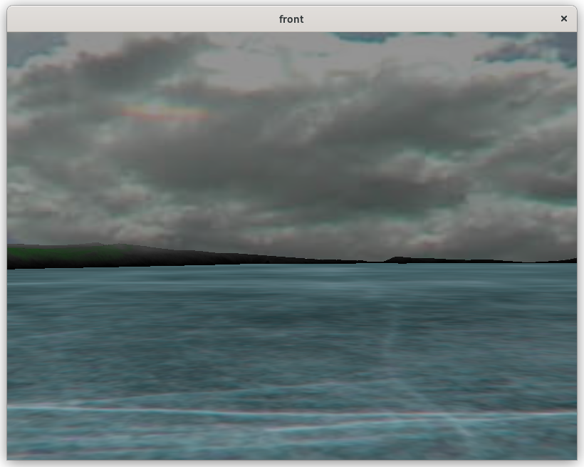

Now let's try practicing the DUSIME state machine, by setting DUSIME
to "holdcurrent" first (watch out, your simulator motion system starts
to move), then run a calibration with the "calibrate" mode (watch out,
the controls may be put through their motion range), then start
simulating with "advance". Now both your "work" and "advance" buttons
are green, and the "hold" button is dark, indicating you can step back
to hold at any time.

Since we have not yet connected any dynamics, nothing much happens. We
can explore some of the DUECA views to see what the simulation is
doing. Open the activity view from DUECA's "View" menu, and press on
"update". You should see something like the following:

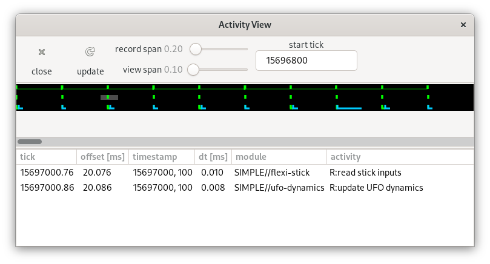

You can select some of the green or blue bars on one of the lines, to
see what is happening there. The activity view takes a snapshot of the
running DUECA, and shows the timeline for each priority level.

The next view to check is the timing view. You will see, that for lack
of real-time priorities and optimization, timing is not perfect. The
timing view gives summary statistics for each activity that you
requested a timing check on. It also shows, in the top section, the
performance of synchronization in different DUECA nodes. The "update
sync" button will collect a new synchronization report, "clear sync"
clears the early/late counters.

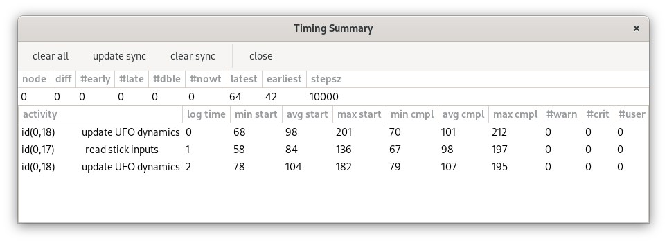

Error messages can be seen in the console where you started dueca, but
they are also assembled and collected in the error log view.

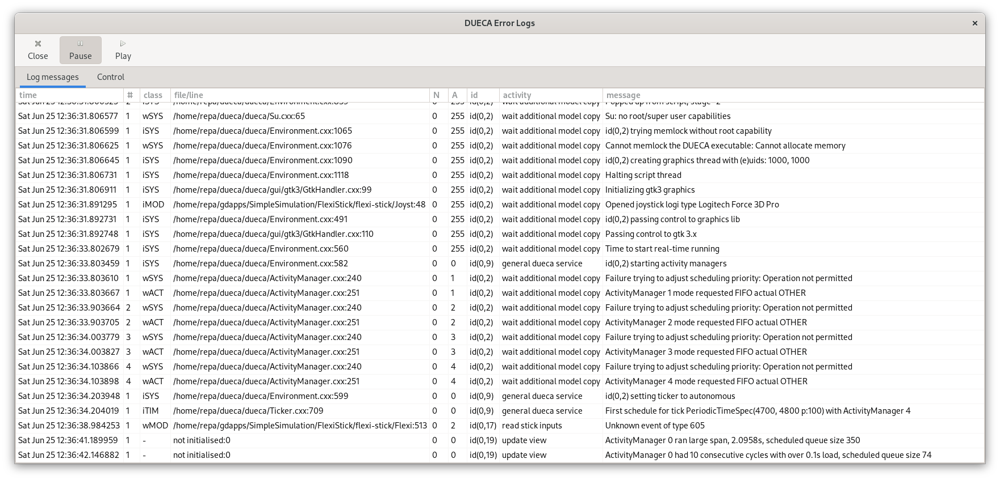

The view lists the time, the class and type of message, node where the
message occurred, id of the module or object involved and the
activity.

The last view we discuss here is the channel view. This view shows all
channels in use in your DUECA process, their entries, who writes
these, who reads these, how many points are written and read. For each
channel you can also open a specific view to inspect the data there.

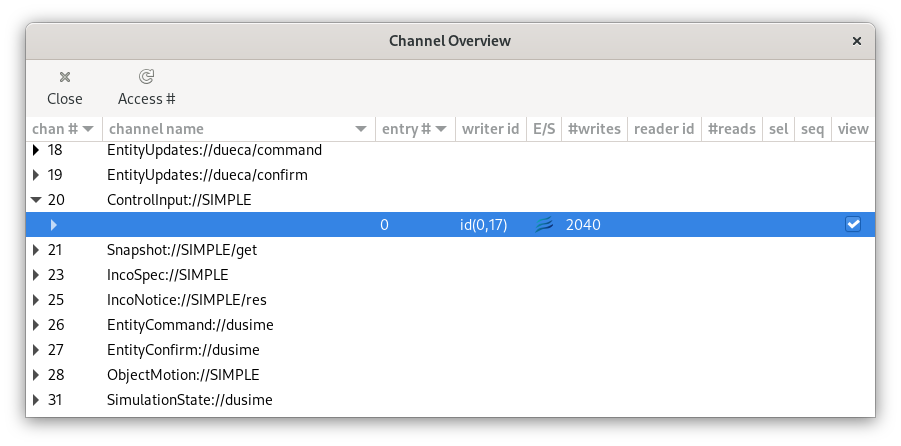

And the detail for a single channel

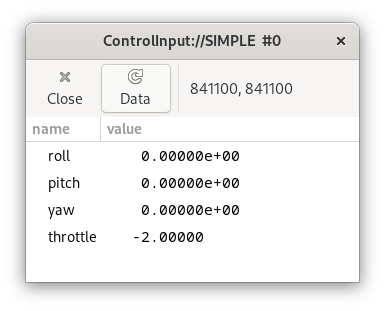

## Log files

After a run, dueca will have left a number of log files in your run
folder. You can inspect these at your leasure. One useful thing to do
with these logs is to create an overview of your simulation. There is a
small script for that:

~~~{.bash}
[enter]$ dueca-channeldot
~~~

The `dueca-channeldot` program reads your logs, and produces a file
`channellayout.pdf`. This simulation is still simple, and it has two
channels without entries, both from world-view, and the
`ControlInput:://SIMPLE` and `ObjectMotion://SIMPLE` channels that
connect the flexi-stick, ufo-dynamics and world-view modules, here is
the channel layout:

## Adding dynamics

Let's turn back to the ufo-dynamics module in the `UFODynamics.hxx`
file, and add some dynamics to it. There is an assortment of
additional simulation tools in the `dueca-extra` package, a potluck
with some code for numerical integration, calibrating and converting
input values, etc. We use the dueca::RigidBody class. You can check
out its documentation; it has a state vector with 13 elements. To
simplify control, we will specify that rotational moments will be
applied on the body until the body rates (p, q, r) follow the stick
inputs. Forces are applied until the body velocity in the forward (x)
direction follows the joystick input.

Add the dynamics to the header file, first some includes:

~~~~{.hxx}
// include headers for functions/classes you need in the module
#include <array>
#include <extra/RigidBody.hxx>
#include <extra/integrate_rungekutta.hxx>
~~~~

And then the additions to the class:

~~~~{.hxx}
  // declare the data you need in your simulation

  // Rigid body dynamics
  RigidBody            body;

  // Workspace for the integration
  RungeKuttaWorkspace  ws;

  // Time constant for following rotational inputs
  double               tau_r;

  // Time constant for following linear inputs
  double               tau_v;

private: // snapshot data
  // temporary storage for the capturing the state
  std::array<12,double> snapcopy;
~~~~

Then initialize in the constructor:

~~~~{.cxx}
  // initialize the data you need in your simulation
  body(1.0, 1.0, 1.0, 1.0, 0.0, 0.0, 0.0),
  ws(13),
  tau_r(0.5),
  tau_v(2.0),
~~~~

And set the positition of the UFO to somthing reasonable in the constructor body:
~~~~{.cxx}
  // set the UFO at a reasonable height (not in the ice, above it!)
  body.initialize(0.0, 0.0, -3.0, 0.0, 0.0, 0.0,
                  0.0, 0.0, 0.0, 0.0, 0.0, 0.0);
~~~~

In this step, we want to add code to have dynamics, and the output to
the WorldView to follow those dynamics. However, we want to also
enable snapshot taking and loading, so that an initial state of our
dynamics can be stored, and recovered later.

First the dynamics. We can add that in the `doCalculation` function,
at the spot where we read data from the joystick. We create forces
from the input and the current linear and rotational velocity, and do
an update step with the Runge-Kutta code.

~~~~{.cxx}
  case SimulationState::Replay:
  case SimulationState::Advance: {
    // access the input
    try {
      DataReader<ControlInput> u(r_controls, ts);

      // apply forces on the body
      body.zeroForces();
      Vector3 moms { -u.data().roll, -u.data().pitch, -u.data().yaw };
      body.applyBodyMoment((moms - body.X().segment(6,3))/tau_r);
      Vector3 forces { u.data().throttle, 0.0, 0.0 };
      static Vector3 cg {0.0, 0.0, 0.0};
      body.applyBodyForce((forces - body.X().segment(0,3))/tau_v, cg);
    }
    catch(std::exception& e) {
      W_MOD("Could not read control input at " << ts);
    }

    // do the simulation calculations, one step
    integrate_rungekutta(body, ws, ts.getDtInSeconds());
~~~~

Now the `RigidBody` object contains the position, orientation and
velocities of our UFO, and we can send these to the world-view
module. This is placed after the case statement:

~~~~{.cxx}
  // calculate additional outputs
  body.output();
  DataWriter<BaseObjectMotion> y(w_egomotion, ts);
  for (unsigned ii = 3; ii--; ) {
    y.data().xyz[ii] = body.X()[3+ii];
    y.data().uvw[ii] = body.X()[ ii];
    y.data().omega[ii] = body.X()[6+ii];
  }
  y.data().setquat(body.phi(), body.theta(), body.psi());
~~~~

To be able to save the state of the `RigidBody` at the requested
moments, we copy the state to an array that has been reserved for that
purpose. The `snapshotNow` function tells the module when that has to
be done, so the last part of the `doCalculation` function is changed
to:

~~~~{.cxx}
  if (snapshotNow()) {
    // keep a copy of the current state
    for (unsigned ii = 3; ii--; ) {
      snapcopy[ii] = body.X()[3+ii]; // copy xyz
      snapcopy[3+ii] = body.X()[ii]; // uvw
      snapcopy[9+ii] = body.X()[6+ii]; // pqr
    }
    snapcopy[6] = body.phi();
    snapcopy[7] = body.theta();
    snapcopy[8] = body.psi();
  }
~~~~

The snapshot is stored in that order, because that is also the order
of the `RigidBody::initialize` function. Now we need to ensure that
the snapshot will be sent in an appropriate format after it has been
made, and that we can restore an initial state from data sent back to
the module. The `UFODynamics::fillSnapshot` function is modified to:

~~~~{.cxx}
void UFODynamics::fillSnapshot(const TimeSpec& ts,
                               Snapshot& snap, bool from_trim)
{
  // The most efficient way of filling a snapshot is with an AmorphStore
  // object.
  AmorphStore s(snap.accessData(), snap.getDataSize());
  assert(snap.getDataSize() == sizeof(snapcopy));

  // set the right format
  snap.coding = Snapshot::Doubles;

  if (from_trim) {
    // use packData(s, trim_state_variable1); ... to pack your state into
    // the snapshot
  }
  else {
    for (const auto &xs: snapcopy) {
      packData(s, xs);
    }
  }
}
~~~~

The `UFODynamics::loadSnapshot` function does the reverse. It will
only be called when the simulation is in `HoldCurrent` mode. The
snapshot data is accessed with an `AmorphReStore` object, which will
read the data from the snapshot, and convert it into -- in this case
-- double variables for initializing the model.

~~~~{.cxx}
void UFODynamics::loadSnapshot(const TimeSpec& t, const Snapshot& snap)
{
  // access the data in the snapshot with an AmorphReStore object
  AmorphReStore s(snap.accessData(), snap.getDataSize());
  double x(s), y(s), z(s), u(s), v(s), w(s);
  double phi(s), theta(s), psi(s), p(s), q(s), r(s);
  body.initialize(x, y, z, u, v, w, phi, theta, psi, p, q, r);
}
~~~~

You can compile and then again try to run the simulation. You will see
that now the viewpoint reacts to inputs on the joystick. As expected,
the dynamics don't interact with the ice floor or the hills on the
side, however, for the purpose of illustrating development with DUECA,
this will be enough. In the following we try to see if what we
programmed can be used in combination with DUSIME's record and replay
functions.

## Initial conditions, recording replay

### Set-up

To enable recording and loading initial conditions, in this case the
initial state for the UFODynamics module, slightly modify the
`dueca_mod.py` file:

~~~~{.py}
    # removed the quotes to enable DUSIME initial condition recording and
    # setting, and simulation recording and replay
    for e in ("SIMPLE",):
        DUECA_mods.append(
            dueca.Module("initials-inventory", e, admin_priority).param(
                # reference_file=f"initials-{e}.toml",
                store_file=f"initials-{e}-%Y%m%d_%H%M.toml"))
        DUECA_mods.append(
            dueca.Module("replay-master", e, admin_priority).param(
                # reference_files=f"recordings-{e}.ddff",
                store_files=f"recordings-{e}-%Y%m%d_%H%M%S.ddff"))
~~~~

This will expand the `View` menu of the DUECA window with two
items. The `reference_file` arguments refer to pre-existing files,
with initial states and recordings in this case, however we don't have
these, so we do without. If later your recordings turn out to have an
impressive set of motion traces, you may convert those recordings
(initials and recording) as reference files.

### Use

Start up the DUECA program, and bring it to hold mode. Now select
`Initial State -- SIMPLE` from the View menu, it will look like this:

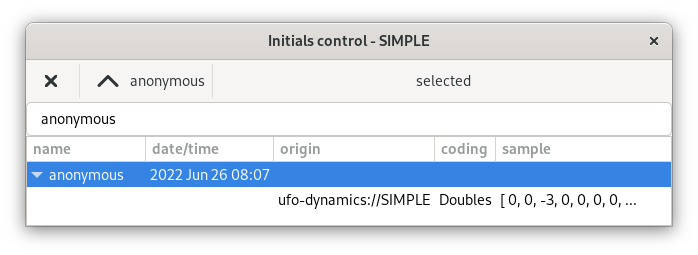

We can now record a "snapshot" of the model state. By filling in an
appropriate name in the entry field of the Initials control window, we
can give it a name, the default name is anonymous. Once you passed
`calibrate`, the `snap` button on the DUECA/DUSIME control panel
should become active. Press it and see what happens; the image above
shows an anonymous snapshot in the list, with a sample of the first
bit of data.

When you re-load the initial state, by pressing the up arrow or caret
(^) next to the name of the selected state in the menubar, the data is
being loaded into the model.

When a snapshot has been taken or re-loaded, it will also be possible
to record the inputs to the flexi-stick module, and replay these
later. Verify that the parameter `enable_record_replay = True` is set
in the parameters for `flexi-stick`, and that you add a `ReplayFiler`
to the list of objects you want to create, just assign it to a python
variable to protect it from the automatic garbage collection in
python:

~~~~{.bash}
    filer = dueca.ReplayFiler("SIMPLE")
~~~~

Now open both the initial state window, and the Replay Control
window. Toggle the replay control window to the record tab. Bring up
DUECA, and control it to pass the calibrate mode. When DUECA/DUSIME is
back in hold mode, press the "snap" button to take a snapshot of the
initial model state.

Once you have taken a state snapshot, or loaded an existing initial
condition, recording your inputs will become possible. Enter a name
for your upcoming recording.

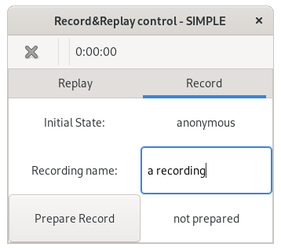

Then press "Prepare record". When you now run the simulation, with
advance, the input to the simulation will be recorded. In combination
with the initial state recorded in the model snapshot, you now have
enough to replay that very same simulation. First select the replay
tab in the Replay Control window:

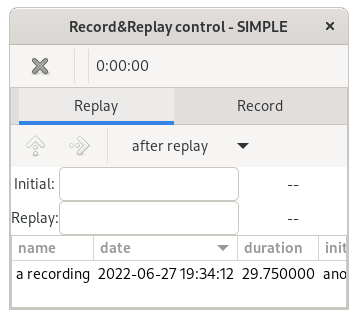

You can now select the created recording. When you do that, you will
notice that the window gives you the corresponding initial state, and
the recording name. With the up arrow or caret you can load this
initial state, and with the right arrow you can prepare the recording
for replay. The simulation returns to its starting position, and you
can see that now the replay button in the DUECA/DUSIME control panel
is active. By pressing the replay button, the simulation starts
replaying the previous inputs.

## Multiple nodes

So far, we have been running a single DUECA process, in a single
computer, probably your development desktop or laptop. DUECA gets
really useful if you can deploy the simulation developed on your
desktop onto a big simulator, with multiple instrument screens and
projectors for the outside view, control devices with control loading
(force simulation) and a motion system. To show the principle, let's
split off the display from the rest of our simulation, and run two
DUECA processes on a single computer. To do this, we need a
configuration for a platform, enter your project folder, and enter:

~~~{.bash}
[enter]$ dueca-gproject new-platform --name simlab
Added platform simlab
[enter]$ ls run
run-data  simlab  solo
~~~

This only added a folder to the run folder. We will define two nodes
in this platform, giving them the names of `host` and `igtest`. We
will assign node number zero to the host node, so the DUECA interface
appear there. We will tell it to connect on a host on interface
`127.0.0.1`, where it will find the "communication master", the
computer that will drive the communication cycle.

~~~{.bash}
[enter]$ dueca-gproject new-node --name host --platform simlab \
         --num-nodes 2 --node-number 0 --if-address 127.0.0.1 --gui gtk3 \
         --machine-class solo --cmaster 127.0.0.1
~~~

This creates a new node in the simlab platform. Because we will not be
connecting to the outside world, we use the "local" ip address
127.0.0.1. The DUECA interfaces will run here, so we select `gtk3` for
the graphical user interface back-end. We use the machine class
`solo`, which means that if we check out the code, the
`dueca-gproject` script looks at the `modules.xml` file in class solo,
checking out the full code. That is simply a shortcut, we could make a
new machine class that includes everything we had now except for the
WorldView modules. There will be some extra code in this DUECA
executable that we will not use when running it, but that should be no
problem.

For the `igtest` node, we define a new machine class `ig`:

~~~{.bash}
[enter]$ dueca-gproject new-machine-class --name ig --gui none
Added new machine class ig
[enter]$ ls .config/class
ig  solo
[enter]$ cat .config/class/ig/modules.xml
<?xml version='1.0' encoding='UTF-8'?>
<!--
     this file contains a list of all modules needed for your application
     on a specific machine

     note that the comm-objects directories should *not* be listed here.
     The module name must be one of the folders in the given project.
     The project must contain the full path to a git repository

     If you encounter a message that a certain comm-objects folder cannot
     be found, use dueca-gproject borrow-project to add that project url

     If you need to check out from a specific branch, version or
     revision, add that in the optional version field.
-->
<machine xmlns="https://dueca.tudelft.nl"
  xmlns:xsi="http://www.w3.org/2001/XMLSchema-instance"
  xsi:schemaLocation="https://dueca.tudelft.nl https://dueca.tudelft.nl/schemas/modules.xsd">
  <project>
    <url>file://home/you/gitrepos/SimpleSimulation.git</url>
  </project>
</machine>
~~~

This added a folder with files in the `.config/class` folder. The ig
node does not need to run gtk interfaces, so we selected `none` for
the graphical user interface. The `modules.xml` file for `ig` is
empty, the quickest fix would be to copy the `modules.xml` file from
the `solo` class, and trim everything there except the `world-view`
modules, so that it looks like:

~~~{.bash}
[enter]$ cat .config/class/ig/modules.xml
<?xml version='1.0' encoding='UTF-8'?>
<!--
     this file contains a list of all modules needed for your application
     on a specific machine

     note that the comm-objects directories should *not* be listed here.
     The module name must be one of the folders in the given project.
     The project must contain the full path to a git repository

     If you encounter a message that a certain comm-objects folder cannot
     be found, use dueca-gproject borrow-project to add that project url

     If you need to check out from a specific branch, version or
     revision, add that in the optional version field.
-->
<machine xmlns="https://dueca.tudelft.nl"
xmlns:xsi="http://www.w3.org/2001/XMLSchema-instance"
xsi:schemaLocation="https://dueca.tudelft.nl https://dueca.tudelft.nl/schemas/modules.xsd">
  <project>
    <url>file://home/you/gitrepos/SimpleSimulation.git</url>
  </project>
  <project>
    <url>https://github.com/dueca/WorldView.git</url>
    <version>add-sample</version>
    <module>WorldView</module>
    <module>OSGViewer</module>
    <module>SpecificationBase</module>
    <module>icy-world</module>
  </project>
</machine>
~~~

Now that we have the new machine class, we can create a node for the simulated ig:

~~~{.bash}
[enter]$ dueca-gproject new-node --name igtest --platform simlab \
         --num-nodes 2 --node-number 1 --if-address 127.0.0.1 --gui none \
         --machine-class ig
Added node igtest in simlab, script python
graphics none, no 1/2 connecting None
~~~

Note that here we don't supply the communication master (cmaster), so
this node will become the master node for communication. In the
configuration file `dueca_cnf.py`, which you will find in the
`run/simlab/igtest` folder, you can see this in the `send_order`
parameter, which will be set to 0.

Adding these nodes modified the file `.config/machinemapping.xml`,
that file will be used when we ask `dueca-gproject` to check-out/clone
a trimmed copy for deployment on a simulator or other device:

~~~{.bash}
[enter]$ cat .config/machinemapping.xml
<?xml version='1.0' encoding='UTF-8'?>
<!-- This file defines the mapping between DUECA nodes and their
     machine class (type of checkout, libraries, modules) -->
<nodes xmlns="https://dueca.tudelft.nl"
xmlns:xsi="http://www.w3.org/2001/XMLSchema-instance"
xsi:schemaLocation="https://dueca.tudelft.nl/ https://dueca.tudelft.nl/schemas/machinemapping.xsd">
  <!-- default development set-up -->
  <node name="solo" machineclass="solo" sparse-checkout="false"/>
  <node name="host" machineclass="solo" sparse-checkout="true"/>
  <node name="igtest" machineclass="ig" sparse-checkout="true"/>
</nodes>
~~~

The `sparse-checkout` flag ensures that not all modules from the
SimpleSimulation project will be checked out. For development on
`solo` you do want all modules there, to see and access all code. Then
the `modules.xml` file will determine which of these modules are
included in the compilation of the executable.

This also added folders and files to the platform:

~~~{.bash}
[enter]$ ls run/simlab/*
run/simlab/host:
clean.script  dueca_cnf.py  dueca_mod.py  links.script

run/simlab/igtest:
clean.script  dueca_cnf.py  links.script
~~~

The `dueca_mod.py` listed there is a default `dueca_mod.py`. However,
we just painstakingly added all kinds of configuration to the
`dueca_mod.py` for solo, so let's copy that and adapt it:

~~~{.bash}
[enter]$ cp run/solo/solo/dueca_mod.py run/simlab/host/dueca_mod.py
~~~

There are some tiny changes, definition of the set-up:

~~~{.bash}
## node set-up
host_node = 0   # local, send peer
ig_node = 1     # also local, send master
~~~

We changed the name for node 0 from `ecs_node` to `host_node`. This is
where we allocate the DUECA interfaces, the joystick interface and the
dynamics module. Change all `ecs_node` to `host_node`.

Now we can split off the configuration for the outside view, move the
ReplayFiler to be in the node 0 if (since it will only be needed
there, the ig does not store or reload data), and add the `world-view`
only in the ig node:

~~~{.py}
    # our new dynamics module
    mymods.append(dueca.Module(
        "ufo-dynamics", "", sim_priority).param(
            set_timing = sim_timing,
            check_timing = (1000, 2000)))

    # records the inputs from the stick
    filer = dueca.ReplayFiler("SIMPLE")

# this ensures that the outside visual is only started on the ig node
if this_node_id == ig_node:
    # the visual output
    mymods.append(
        dueca.Module(
            "world-view", "", admin_priority).param(
    # etc .....
~~~

There is one final thing we have to change in the `dueca_cnf.py` for
the `igtest` node. When DUECA starts up on two nodes, our `host` node
will contact the `igtest` node for instructions on how to further
communicate. The default communication is set to UDP Multicast, since
that gives good performance on typical simulation set-ups, but this
won't work over the localhost (127.0.0.1) interface. We can change the
data connection to use websockets:

~~~~~~~{.py}
# * data communication, only used on comm master
#   If using udp, the network address implies the communication type;
#   multicast, broadcast, or else peer-to-peer
#   If using websockets (less real-time, better for crossing firewalls),
#   the websocket base URL must match the configuration socket
# data_url = "udp://" + mc_address + ":" + str(mc_port+1)
data_url = "ws://" + master_host + ":" + str(mc_port) + "/data"
~~~~~~~

Now do a `git commit -a` and celebrate! Let's see if this worked, and
pretend we are headed to a simulation facility with multiple computers
driving the simulation, and check out / clone our recently developed
project:

~~~{.sh}
[enter]$ cd /tmp
[enter]$ mkdir host
[enter]$ mkdir igtest
[enter]$ cd host
[enter]$ # check out the project, note we are on the initial-development branch
[enter]$ dueca-gproject clone --remote ${PROJECTURL} --node host --version initial-development
Cloned project to /tmp/host/SimpleSimulation/SimpleSimulation for machine class solo
[enter]$ dueca-gproject build --debug
... lots of output! ...
... more output! ...
[100%] Built target dueca_run.x
[enter]$ cd /tmp/igtest
[enter]$ dueca-gproject clone --remote ${PROJECTURL} --node igtest --version initial-development
[enter]$ # You know the rest of the drill by now....
~~~

You now have two compiled DUECA executables, with a new platform,
with two nodes. You need two terminal windows to try and run
this. Also, I forgot about the links.script for the `ig` node. We
should copy over the `links.script` from solo and commit that,
otherwise there is no access to the graphics files.

Terminal 1

~~~{.bash}
[enter]$ cd /tmp/igtest/SimpleSimulation/SimpleSimulation/run/simlab/igtest
[enter]$ # correct my mistake from here...
[enter]$ cp ../../solo/solo/links.script .
[enter]$ git commit -a -m "fix links.script for igtest"
[enter]$ git push
[enter]$ . links.script
[enter]$ ./dueca_run.x
~~~

While this executable is anxiously waiting for colleague DUECA's to
join it, hop over to the other terminal, and start there:

Terminal 2

~~~{.bash}
[enter]$ cd /tmp/host/SimpleSimulation/SimpleSimulation/run/simlab/host
[enter]$ . links.script
[enter]$ ./dueca_run.x
~~~

In the logs written to the terminal you will see the two DUECA
executables connecting, and then synchronizing to each other's
timing. The DUECA/DUSIME control panel now shows the two nodes, and
the Entities overview indicates which module runs where; in this case
only the `world-view` runs in node 1. There is a neat little
additional window in the view menu, the `Net Use View`. It shows a
histogram for timing and for occupancy of the network messages.

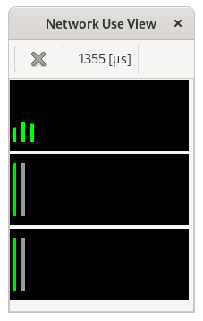

Everything should now work as before, but the `Activity View` has an
additional set of lines for the second node, and the `Timing View`
shows a line on the synchronization of the second node.
