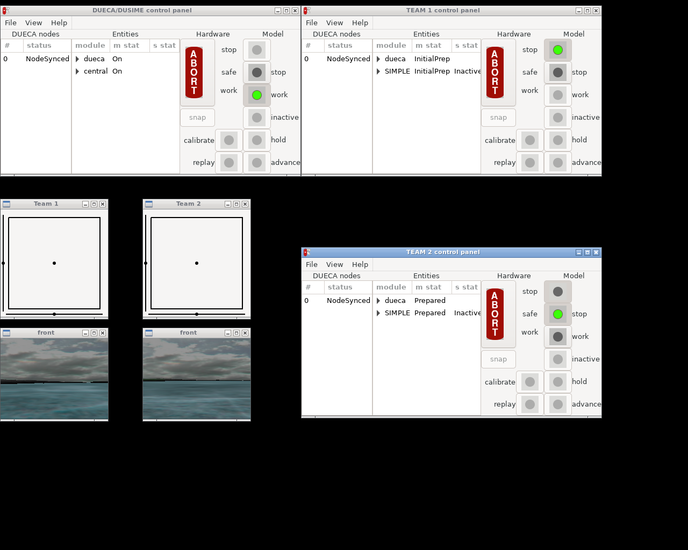

# More Simple Simulation (#example2b)

## Introduction

The [A Simple Simulation](#example2) chapter explained how to create a
DUECA simulation with one "player", re-use existing modules, create new
modules, and configure a simulation for running on a multi-computer set-up.

Here we look at how to connect multiple simulations together. In this way,
a multiplayer simulation can be made. Each player has his/her own DUECA
controls, and can start and run independently from the other players.
However, data between players can be exchanged, so it is possible to
"see" the other players, by, e.g., showing their avatars / graphical models
in the world visualisation.

We will start by adding a simple module to our simulation to track whoever
is currently "in the game". Then we discuss ways of configuring the multi-
player simulation.

## Overview module

### Initial code generation

To track what is happening, we will create an overview module. Use the
`dueca-gproject` command to get a new module called
`monitor-teams`. Now enter the `monitor-teams` folder and create code
for the modules. Teams can join at any time, and start moving (with
the DUECA Advance mode) at any time, and each team will have their own
DUECA process to control. So it makes no sense to make the monitoring
module dependend on DUSIME state, we simply always monitor. The
monitoring module can therefore be a pure DUECA module:

~~~~{.bash}
[enter]$ cd monitor-teams
[enter]$ new-module dueca
Give a (full) name for the module: MonitorTeams
A description for the activity:  : show team status
~~~~

### Ensuring we can read channel data

We can use the `BaseObjectMotion` DCO datatype from the `WorldView`
project to send information about moving objects around. To be able to
read that, this must be added to the `comm-objects.lst` file, add the
following line:

    WorldView/comm-objects/BaseObjectMotion.dco

We are already using the `WorldView` for the visualisation, so it is
given in the `modules.xml` file, and `dueca-gproject` will know where
to get the code from.

The DUECA interconnection facilities can also send information on
joining and leaving peers. That is given in a `ReplicatorInfo` DCO,
which is installed with the DUECA headers and libraries. Define two
read tokens in the `MonitorTeams.hxx` header file, called `r_announce`
and `r_world`, and uncomment the line that defines a clock
(`myclock`).

### Adding a second activity to the module

Our "overview" module will be very simple, we just print information
on joining and leaving peers, and information on the entries we find
in the channel with `BaseObjectMotion` objects. To simplify our
design, we add a second callback and a second activity to the module,
just for printing the notifications. This needs the following in the
header file:

* A callback object:
  ~~~~{.c++}
    /** Callback object for simulation calculation. */
    Callback<MonitorTeams>  cb2;
  ~~~~
  Add this below the first callback object.

* A second activity:
  ~~~~{.c++}
    /** Activity for simulation calculation. */
    ActivityCallback        do_notify
  ~~~~
  Add it below the first activity object.

- and a function that is to be called:
  ~~~~{.c++}
    /** print a notification about a leaving or joining peer */
    void doNotify(const TimeSpec& ts);
  ~~~~
  Add it below the `doCalculation` function declaration.

### Writing the implementation

Now take a look at the `MonitorTeams.cxx` file. You may notice it is a
bit smaller than the `UFODynamics` files, it misses parts for the
DUSIME communication; different modes to run in, and sending and
receiving snapshots.

The announcement channel should have only one entry in it. It contains
`ReplicatorInfo` objects, and they are written as events. The channel
name will be configurable from the script, but we will use a simple
convention; `ReplicatorInfo://<entity name>`, where in this example
the entity name is will `central`. To have access to the definition,
we will include the proper header:

~~~~{.c++}
#include <dueca/inter/ReplicatorInfo.hxx>
~~~~

Now add the tokens to the constructor implementation:

~~~~{.c++}
  r_announce(getId(), NameSet(getEntity(), ReplicatorInfo::classname, part),
             ReplicatorInfo::classname, 0, Channel::Events),
  r_world(getId(), NameSet("world", BaseObjectMotion::classname, part),
          BaseObjectMotion::classname, entry_any, Channel::AnyTimeAspect,
          Channel::ZeroOrMoreEntries),

  // clock
  myclock(),

  // a callback object, pointing to the main calculation function
  cb1(this, &_ThisModule_::doCalculation),
  cb2(this, &_ThisModule_::doNotify),
  // the module's main activity
  do_calc(getId(), "check up", &cb1, ps),
  do_notify(getId(), "print notification", &cb2, ps)
~~~~

I also added the uncommented clock in the code snippet, the two
callback objects and the two activities. Each of these activities
needs a trigger. In the body of your `MonitorTeams` constructor, set
the trigger for your `do_calc` to the clock you just uncommented, and
the trigger for the `do_notify` to the `r_announce`
dueca::ChannelReadToken.

You would want the notification activity to always work. To do that,
we can switch it on in the `complete()` method, and switch it off
again in the destructor. If you don't specify a time for the `switchOn()/switchOff()` calls, it basically means now!

Add to the complete method:

~~~~{.cxx}
  do_notify.switchOn();
~~~~

And to stop this again in the destructor:

~~~~{.cxx}
  do_notify.switchOff();
~~~~

The check-up on current status is done on the basis of time. Adapt the
`setTimeSpec` call to modify the clock rather than the activity:
~~~~{.cxx}
  // specify the timespec to the clock
  myclock.changePeriodAndOffset(ts);
~~~~

We need to check the two tokens in the `isPrepared` call:

~~~~{.cxx}
  // Check used tokens
  CHECK_TOKEN(r_world);
  CHECK_TOKEN(r_announce);
~~~~

Switching the main (`do_calc`) activity is already present in the
`startModule` and `stopModule` calls.

Adapt the `doCalculation` method to run through all entries in the
`r_world` token, and print the result:

~~~~{.cxx}
  unsigned ecount = 0;
  r_world.selectFirstEntry();
  while (r_world.haveEntry()) {
    ecount++;
    try {
      DataReader<BaseObjectMotion,MatchIntervalStartOrEarlier> om(r_world);
      std::cout << "Ufo " << r_world.getEntryLabel() << " now at "
		<< om.data().xyz << std::endl;
      std::cout << "Current tick " << ts.getValidityStart()
		<< ", data generated at "
		<< om.timeSpec().getValidityStart() << std::endl; 
    }
    catch (const NoDataAvailable& e) {
      std::cout << "Ufo " << r_world.getEntryLabel() << " no data" << std::endl;
    }
    r_world.selectNextEntry();
  }

  // This shows we looked.
  std::cout << "There were " << ecount << " entries" << std::endl;
~~~~

With this set-up, the `DataReader` will try to find the very latest
data from the channel.

The new `doNotify` method looks very simple:

~~~~{.cxx}
void MonitorTeams::doNotify(const TimeSpec& ts)
{
  DataReader<ReplicatorInfo> ri(r_announce, ts);
  cout << ri.data();
}
~~~~

This works only because DUECA will generate exactly one activation for
each time the channel with ReplicatorInfo objects is written, and that
calls one run of the `doNotify` method, with the correct time
specification. 

## Adapting the UFODynamics module

We now have a monitor module for information that different teams may
send us, but what information will we get from the teams? We need to
add an extra output to the `UFODynamics` module, and we will send this
information over a channel that is shared by all teams.

Open the `UFODynamics.hxx` file, and add a write token for the world:

~~~~{.cxx}
  /** For sharing our position to the world view, so in multiplayer we
      can be seen. */
  ChannelWriteToken   w_world;
~~~~

And in the `UFODynamics.cxx` file, initialise it in the constructor:

~~~~{.cxx}
  // this channel is labeled with our entity name. 
  w_world(getId(), NameSet("world", "BaseObjectMotion", ""),
	  BaseObjectMotion::classname, getEntity(), Channel::Continuous,
	  Channel::OneOrMoreEntries),
~~~~

You can see that instead of `getEntity()` in the `NameSet`, i.e., the
name of the channel, we simply hardcoded `"world"`. The label of the
channel is then again set to our entity name, so in the examples below
that will be `team1` or `team2`. The channel has stream data
(continuous positions) and can have multiple entries.

We already write a `BaseObjectMotion` DCO for driving the viewpoint of in the 3D world. We can add two lines to the `doCalculation` method to copy that over to the world channel, so after writing the position to `w_egomotion`, add:

~~~~{.cxx}
  // copy this, so others see where we are (in multiplayer)
  DataWriter<BaseObjectMotion> pub(w_world, ts);
  pub.data() = y.data();
~~~~

## Platforms

### Set-up teams

Let's now mis-use DUECA's carefully laid out [file
configuration](#appdevelg), and create a platform for a simulation
with the monitor and for two (for example) simulations with each a
team (we actually should be creating three platforms with each one
node).

~~~~{.sh}
[enter] $ dueca-gproject new-platform --name multi
[enter] $ dueca-project new-node --name central --platform multi \
	          --num-nodes 1 --node-number 0 --gui gtk3 --script python
[enter] $ dueca-project new-node --name central --platform team1 \
	          --num-nodes 1 --node-number 0 --gui gtk3 --script python
[enter] $ dueca-project new-node --name central --platform team2 \
	          --num-nodes 1 --node-number 0 --gui gtk3 --script python
~~~~

This gives us three places to run a single-node python process
from. We will adapt the `dueca_mod.py` file that is in the `solo`
platform for the two teams; copy that one over the respective files in
the `team1` folder. While you are at it, also copy over the
`links.script` file to the `team1` and `team2` folder.

Now for making sure we can communicate. Add `inter` to the list of
`DUECA_COMPONENTS` in the main `CMakeLists.txt` file, this adds all
inter-communication code to your executable.

Now open the copied `dueca_mod.py` file. Rename the entity, replace
all occurrences of `SIMPLE` with `team1`.

Let's modify also the stick interface. You might not have two
joysticks on your computer (if you have, simply skip this step), so we
will use a small GUI to provide joystick input. Find the `flexi-stick` code, 
remove the `add_device` line (which accessed the first SDL device), and replace it with the configuration to create a gui interface:

~~~~{.py}
                # virtual, gtk driven stick
                ('add-virtual', ("logi",)),
                # axes 0 and 1, roll and pitch
                ('add-virtual-slider-2d',
                 (15, 15, 185, 185, 3)),
                # axis 2, yaw
                ('add-virtual-slider',
                 (10, 195, 190, 195, 3)),
                # axis 3, throttle
                ('add-virtual-slider',
                 (5, 190, 5, 10, 3, 1)),
~~~~

The funny specification of the argument to `add-virtual` is needed
because a list or tuple is expected here. The rest of the joystick
configuration can stay the same.

Now make sure we send information on the position to the other
simulations, add the following module:

~~~~{.py}
    mymods.append(dueca.Module(
        'channel-replicator-peer', "", com_priority).param(
            port_re_use=True,
            config_url="ws://127.0.0.1:8032/config"))
~~~~

This is the replicator. It will contact a master replicator on the
given websocket url, you can see that is on the local host interface.

For `team2`, you can use almost the exact same `dueca_mod.py` file,
copy it over, and change all occurrences of `team1` with `team2`.

### Monitor configuration

The configuration for the monitor, in `central`, is a bit
different. Let's call this entity central. We will add only our new
monitoring module:

~~~~{.py}
if this_node_id == ecs_node:

    # this simply prints joining of teams and current position
    mymods.append(dueca.Module(
        "monitor-teams", "", sim_priority).param(
            set_timing = mon_timing,
            check_timing = (10000, 20000)))
~~~~

And now a channel replicator, but the master. This one needs a bit more configuration:

~~~~{.py}
    # this is a standard DUECA module (from the "inter" library), that
    # can connect to other DUECA processes, and replicate given channels
    mymods.append(dueca.Module(
        'channel-replicator-master', "", com_priority).param(
            timing_gain=0.00001,
            set_timing=sim_timing,
            watch_channels=("BaseObjectMotion://world", ),
            message_size=1450,
            replicator_information_channel="ReplicatorInfo://central",
            data_url="ws://127.0.0.1:8032/data",
            config_url="ws://127.0.0.1:8032/config"))
~~~~

With the list in `watch_channels`, you determine which information is
copied between the different DUECA processes. The master replicator
will inform the peers which channels those are. Any entry found in
those channels (and created locally where it is found), will be read
by the replicators, and transmitted to the other replicators, and
these will write the entry locally on the other ends.

The channel replicators have a number of additional options. It is
possible to communicate over udp multicast, udp broadcast, udp
point-to-point, or, as is done here, over websocket interfaces, by
adapting the data url. Starting and configuration is always over
websockets. It is also possible to configure the replicators when you
are behind a network translating firewall, e.g., on a home network.

## Testing things

You can start the dueca processes by opening shell windows in
`central`, `team1` and `team2`, first run the `links.script` files,
and then simply start the dueca processes by entering:

~~~~{.sh}
[enter] $ ./dueca_run.x
~~~~

Three times. This will give you three DUECA windows, one for the
monitor, and two for the two teams. It should look something like the
following, with the exception that your outside windows may be larger,
and you have the shell windows open.

Once you have the monitor in work (it won't go any further, because
there are no DUSIME modules in that process), you will see messages
about the other teams in your console. A team joins when the DUECA
state machine is set to work, and you can operate the DUSIME buttons
like in the previous example.

## Seeing each other

To be completed.
